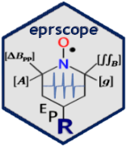

<!-- README.md is generated from README.Rmd. Please edit that file -->

```{r, echo = FALSE}
knitr::opts_chunk$set(
  collapse = TRUE,
  comment = "#>",
  webshot = "webshot",
  fig.path = "man/figures/README-",
  fig.width = 7.2,
  fig.height = 4.8
)
```

<!-- badges: start -->

[](https://lifecycle.r-lib.org/articles/stages.html#experimental) [](https://github.com/jatanRT/eprscope/actions/workflows/R-CMD-check.yaml) [](https://jatanrt.r-universe.dev/eprscope)

<!-- badges: end -->

## Overview 

The key objective of this open source {width="16" height="16"} package is to bring handy functions corresponding to "everyday" data processing/analysis in the EPR ([Electron Paramagnetic Resonance](https://chem.libretexts.org/Bookshelves/Physical_and_Theoretical_Chemistry_Textbook_Maps/Electron_Paramagnetic_Resonance_(Jenschke))) spectroscopy mainly in chemistry. Similar {width="16" height="16"} tools like [cwepr](https://www.cwepr.de/index) and the [related projetcs](https://docs.cwepr.de/v0.5/) have been developed, so far. The `{eprscope}`, as the first complex {width="16" height="16"} **package** 📦 for EPR, **doesn't want to replace the latter nor the excellent and standard EPR simulation/processing** [EasySpin Toolbox](https://www.easyspin.org/) for [MATLAB](https://www.mathworks.com/products/matlab.html) and its additional frameworks like [SpecProFi](https://www.radicals.uni-freiburg.de/de/software) or [CW EPR Scripts by Emilien Etienne](https://bip.cnrs.fr/epr-facility/software-and-scripts/). Rather, **it may be considered like a complementary** 📦 **or toolbox with practical functions which have to be otherwise performed by several proprietary tools**. For instance, like acquisition/processing software, supplied by the EPR spectrometer manufacturers (see e.g. [*Xenon/WinEPR*](https://www.bruker.com/en/products-and-solutions/mr/epr-instruments/epr-software.html)) as well as several other software platforms like the *MS Office* and/or *Orgin/SigmaPlot/Igor* which are often applied in the EPR processing/analysis workflow. Therefore, the `{eprscope}` tries to reduce such many steps/programs if the above-mentioned software combination would be adopted. In order to achieve the goal it uses superior power of the open source {width="16" height="16"} ecosystem that combines data processing, analysis and great scientific visualizations together with the extensive publishing capabilities by [Rmarkdown](https://rmarkdown.rstudio.com/index.html) and [Quarto](https://quarto.org/). Everything at one place (see the [RStudio IDE](https://docs.posit.co/ide/user/)) without the need to switch between or employ any other additional software.

## Installation

Before the installation, please make sure that you have already followed instructions for the [{nloptr} package installation](https://astamm.github.io/nloptr/) depending on your operating system. This package is required for the proper running of the `{eprscope}` optimization/fitting functions.

```{r installation,eval=FALSE,echo=TRUE}

# after the initial R-environment setup (see below) it's always 
# good to install essential collection of packages for data science 
# with all their dependencies:
# install.packages("tidyverse",dependencies = TRUE)
#
# package can be installed by =>
if (!require(devtools)) {install.packages("devtools")}
devtools::install_github("jatanRT/eprscope")
#
# alternatively, install package together with the vignettes/articles:
# if (!require(devtools)) {install.packages("devtools")}
# devtools::install_github("jatanRT/eprscope",build_vignettes = TRUE)

```

Completely new  users or people who haven't already installed the *R* environment, please consult the following steps prior to own `{eprscope}` installation ➨

1.  [the R installation procedure](https://cran.rstudio.com/)

2.  [installation of the Rstudio IDE](https://posit.co/download/rstudio-desktop/) (alternatively, you may try its [cloud version](https://docs.posit.co/cloud/) without the need for {width="16" height="16"} installation)

3.  [the latest R tools release](https://cran.r-project.org/bin/windows/Rtools/) **ONLY for WINDOWS OS**

Additionally, **the open-source scientific and technical publishing system** [Quarto](https://quarto.org/) together with the [Pandoc](https://pandoc.org/), **a document converter system**, may be required for sharing the results coming from `{eprscope}` in desired formats like `pdf` , `html` , `docx` , `pptx` or `tex` (details may be found in the `create_qmdReport_proj()` documentation).

## Usage

In this section, couple of examples are shown in order to briefly demonstrate the package functionality. More detailed description can be found within the articles/vignettes or documentation examples.

### Reading Files with Instrumental Parameters

```{r parameter-reading,warning=FALSE,message=FALSE}

# loading the package/library
library(eprscope)
#
# loading the built-in example file => "TMPD_specelchem_accu_b.par"
tmpd.params.file <-
  load_data_example(file = "TMPD_specelchem_accu_b.par")
#
# parameters into interactive table (data frame)
tmpd.params.dt <-
  readEPR_params_tabs(
    path_to_dsc_par = tmpd.params.file,
    origin = "winepr",
    interact = "params"
  )
#
# table preview
tmpd.params.dt

```

### Depict Molecular Structures

```{r molecule-drawing,warning=FALSE, message=FALSE}

# Pphenalenyl (Perinaphthenyl or PNT) radical by `SMILES` code:
# "C1([C.]23)=CC=CC2=CC=CC3=CC=C1"
draw_molecule_by_rcdk(
  molecule = "C1([C.]23)=CC=CC2=CC=CC3=CC=C1",
  mol.label = "Phenalenyl",
  mol.label.color = "black",
  mol.label.xy.posit = c(8.8, 1.2)
)

```

### Simulation of Isotropic EPR Spectra

```{r spectra-simulation,warning=FALSE, message=FALSE}

# simulation of the phenalenyl (perinaphthenyl or PNT) radical,
# see also https://pubs.rsc.org/en/content/articlelanding/2006/CS/b500509b,
# the additional experimental/instrumental parameters are not shown,
# they posses their default values => see the corresponding documentation
# of `eval_sim_EPR_iso()` function.
simulation.iso <-
  eval_sim_EPR_iso(
    g.iso = 2.0027,
    B.unit = "G",
    nuclear.system = list(
      list("1H", 3, 5.09), # 3 x A(1H) = 5.09 MHz
      list("1H", 6, 17.67) # 6 x A(1H) = 17.67 MHz
    ),
    lineGL.DeltaB = list(0.24, NULL) # linewidth in G
  )
#
# simulation spectrum preview in the region from 3470 G to 3522 G
simulation.iso$plot + 
  ggplot2::coord_cartesian(xlim = c(3470, 3522))

```

### Radical Kinetic Model Fitted onto the Experimental Data

```{r kinetic-model-fit,warning=FALSE,message=FALSE}

# decay of a triarylamine radical cation right after 
# its generation by electrochemical potentiostatic oxidation 
# in TBAPF6/CH3CN, double integrals (Areas) vs time were 
# obtained by data pre-processing within the continuous 
# wave (CW) EPR spectrometer acquisition/processing software.
#
# loading the built-in example file with instrumental parameters
triarylamine_rc_decay_dsc <-
  load_data_example(file = "Triarylamine_radCat_decay_a.DSC")
#
# loading the built-in example file with "Area" vs "time" data frame
triarylamine_rc_decay_txt <-
  load_data_example(file = "Triarylamine_radCat_decay_a.txt")
triarylamine_rc_decay_data <-
  readEPR_Exp_Specs(
    path_to_ASC = triarylamine_rc_decay_txt,
    header = TRUE,
    fill = TRUE,
    select = c(3, 7),
    col.names = c("time_s", "Area"),
    x.unit = "s",
    x.id = 1,
    Intensity.id = 2,
    qValue = 1700,
    data.structure = "others"
  ) %>% na.omit()
#
# fitting the experimental decay by 2R --> B kinetic model
# with "k1" rate constant and the corresponding partial
# rection order "alpha". "qvar0R" refers to initial
# "quantitative variable" (such as concentration, double integral
# or number of radicals) of the triarylamine radical cation "R".
triarylamine_rc_decay_model <-
  eval_kinR_EPR_modelFit(
    data.qt.expr = triarylamine_rc_decay_data,
    model.react = "(r=2)R --> [k1] B",
    elementary.react = FALSE,
    params.guess = c(
      qvar0R = 0.019,
      k1 = 0.04,
      alpha = 1.9
    ),
    time.correct = TRUE,
    path_to_dsc_par = triarylamine_rc_decay_dsc,
    origin = "xenon"
  )
#
# graph preview
triarylamine_rc_decay_model$plot
#
# data frame/table of the obtained kinetic parameters
# by the non-linear fit and numeric solution
# of the Ordinary Differential Equations
triarylamine_rc_decay_model$df.coeffs

```

## Help, Questions and Contribution

There are several ways how to get help. If the users are already familiar with the [R statistical language](https://www.r-project.org/) please, follow either the individual package function documentation or the corresponding articles/vignettes. These might be also considered as a kind of EPR spectroscopy and {width="16" height="16"} knowledge resources, particularly for students. **In case you are completely new to *R***, there are couple of great tutorials enabling a quite straightforward diving into {width="16" height="16"}. **Please, refer to e.g.**

-   [R for Data Science (2e)](https://r4ds.hadley.nz/)

-   [ggplot2: Elegant Graphics for Data Analysis (3e)](https://ggplot2-book.org/)

-   [Advanced R](https://adv-r.hadley.nz/)

-   [POSIT Homepage](https://posit.co/)

-   [R Crash Course](https://colauttilab.github.io/RCrashCourse/)

-   [Statology R Guides](https://www.statology.org/r-guides/)

-   [An Introduction to R](https://intro2r.com/)

-   [R CODER](https://r-coder.com/)

-   [Why should I use R ? (Series)](https://www.jumpingrivers.com/blog/comparing-r-excel-data-wrangling/)

-   [R to Python Data Wrangling](https://gist.github.com/conormm/fd8b1980c28dd21cfaf6975c86c74d07)

-   [Official Contributed Documentation of R](https://cran.r-project.org/other-docs.html)

-   [The Big Book of R](https://www.bigbookofr.com/)

-   [Reproducible Research in R and Guides for the R-Cubed Courses](https://guides.rostools.org/)

-   [Quarto - An Open Source Scientific and Technical Publishing System](https://quarto.org/docs/get-started/hello/rstudio.html)

-   [R for Non-Programmers: A Guide for Social Scientists](https://bookdown.org/daniel_dauber_io/r4np_book/)

-   YouTube Video Tutorials ➨

    -   [Introduction to R Programming for Excel Users](https://www.youtube.com/watch?v=Ekp2mfxQSzw)

    -   [Bioinformatics and R Programming](https://www.youtube.com/@LiquidBrain)

    -   [R Programming 101](https://www.youtube.com/@RProgramming101)

    -   [Equitable Equations](https://www.youtube.com/@EquitableEquations)

    -   [R Programming Full Course 2023](https://www.youtube.com/watch?v=Q5g6lYUn6Q4)

    -   [Plotting Anything with ggplot2](https://www.youtube.com/watch?v=h29g21z0a68)

    -   [Riffomonas Project](https://www.youtube.com/@Riffomonas)

    -   [Introduction to R for Beginners](https://www.youtube.com/@DataSciencePursuit/playlists)

    -   [Reproducible Research with R](https://www.youtube.com/watch?v=mg95lLyCpQA)

    -   [R for Ecology](https://www.youtube.com/@RforEcology/videos)

    -   [R Quarto](https://www.youtube.com/playlist?list=PL9HYL-VRX0oQI8fVioFxMTBrViFnRX_Df)

Even though the **EPR spectroscopy** is a quite complex field there are some introductory on-line materials which may help to start with this special magnetic resonance method ➨

-   [EasySpin Documentation](https://easyspin.org/easyspin/documentation/) + [EasySpin Academy - YouTube (Video Series)](https://www.youtube.com/playlist?list=PLHgZIxCMfgeIPWRCGMBs5T3Mb0TwLpAy2)

-   [EPR LibreTexts in Chemistry](https://chem.libretexts.org/Bookshelves/Physical_and_Theoretical_Chemistry_Textbook_Maps/Electron_Paramagnetic_Resonance_(Jenschke))

-   [NMR Spectroscopy of Organic Compounds (Lesson 10)](https://nmr.group.uochb.cz/en/nmr-organic-compounds)

-   [Bruker EPR Instruments](https://www.bruker.com/en/products-and-solutions/mr/epr-instruments.html)

-   [EPR Everywhere](https://researchoutreach.org/articles/electron-paramagnetic-resonance-epr-everywhere/)

-   [Basic Concepts of EPR](https://epr.ethz.ch/education/basic-concepts-of-epr.html)

Any additional questions, comments, remarks or issues can be addressed through several discussion channels like 📧 e-mail [jantar40\@protonmail.com](mailto:jantar40@protonmail.com){.email} or github {width="16"} issues on the github source page (see the [contributing guide](./.github/CONTRIBUTING.md)). In the future, there will be also a specialized [Discord](https://discord.com/) community channel to discuss the `{eprscope}` related topics. If somebody is able and interested in the package development, please refer to [contributing guide](./.github/CONTRIBUTING.md).

## Acknowledgements

I would like to express a deep gratitude to my colleagues from the [NMR Spectroscopy Group](https://nmr.group.uochb.cz/en) of the [Institute of Organic Chemistry and Biochemistry](https://www.uochb.cz/en) especially, [Dr. Radek Pohl](https://orcid.org/0000-0001-7898-946X) , [Dr. Ondřej Socha](https://orcid.org/0000-0002-7218-9119) {width="16"} and [Dr. Martin Dračínský](https://orcid.org/0000-0002-4495-0070) . Without the fruitful environment within the NMR Spectroscopy team it wouldn't be possible to develop such a project like this. Also, I'd like to give a special thanks to my brother [Dr. Peter Tarábek](https://orcid.org/0000-0002-7181-7136) {width="16"} for his valuable comments and remarks.
