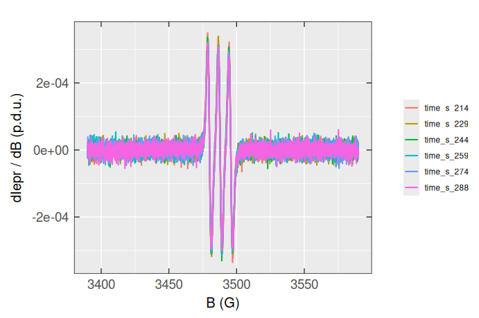
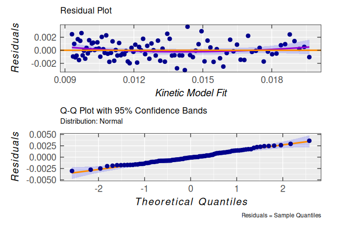

# First Steps with R Language

\\\require{mhchem}\\

This article/vignette deals with essential syntax and/or basic commands
to run the [eprscope](https://jatanrt.github.io/eprscope/) functions.
For details or more advanced programming experience, please refer to the
resources in [*README*
file/Homepage](https://jatanrt.github.io/eprscope/index.html). Sections,
discussing the basics of plotting (several plots are already presented)
and operations with strings will be added in the upcoming package
versions.

## 1 Variable/Function Names and Assignment

Any name, even the complex one (see vide infra), can be applied to
assign the variable/function. It is common to use complex names with the
parts separated either by underscore `..._...` or by dot, like stated in
the examples below. Both assignment operators (`<-` and `=`) can be used
in  language. However, the application of the first
one is preferred, due to the fact that the `=` is a pure assignment
operator and it does not necessarily initialize a variable in the
namespace (e.g. as arguments in a function, see below). Whereas, the
`<-` always creates a variable
([1](#ref-assignR2018)–[4](#ref-wickham2019)). In order to improve the
code readability, comments may be included, starting the line with the
hash symbol `#` like shown in the following code chunks.

``` r

# Q value (EPR sensitivity instrumental factor) assignment:
Q_value <- 3500
#
# loading package built-in example file/data => "TMPD_specelchem_accu_b.asc",
# which corresponds to the EPR spectrum of Wuster's blue:
tmpd.data.file <- load_data_example(file = "TMPD_specelchem_accu_b.asc")
# where `file` is the argument of the `load_data_example` function
```

The `file` within the parentheses represents an **argument of the
function**
[`load_data_example()`](https://jatanrt.github.io/eprscope/reference/load_data_example.md)
and **its assignment must be solely provided by the `=` operator.** If
several arguments are defined, they have to be separated by `,`
(“comma”).

## 2 Functions and Packages

Packages are fundamental units of shareable code. They may bundle
functions, sample code, datasets, documentation and tests
([5](#ref-GfG2023), [6](#ref-wickham2023)). By default, during the
 installation, only a couple of packages are set up
(e.g. `{base}` , `{datasets}` , `{graphics}` , `{grdevices}` , `{stats}`
, `{utils}` ). These are also immediately available, once you start the
 console or *Rstudio* IDE (Integrated Development
Environment). Additional packages must by installed and loaded
explicitly in order to be utilized. To load such packages, the function
[`library()`](https://rdrr.io/r/base/library.html) has to be executed.
It actually refers to the (default) place (folder) where the 📦 is
stored on your computer, such as loading the collection of essential
data science packages called [{tidyverse}](https://www.tidyverse.org/):

``` r

library(tidyverse)
#> ── Attaching core tidyverse packages ──────────────────────── tidyverse 2.0.0 ──
#> ✔ dplyr     1.1.4     ✔ readr     2.1.6
#> ✔ forcats   1.0.1     ✔ stringr   1.6.0
#> ✔ lubridate 1.9.4     ✔ tibble    3.3.0
#> ✔ purrr     1.2.0     ✔ tidyr     1.3.1
#> ── Conflicts ────────────────────────────────────────── tidyverse_conflicts() ──
#> ✖ dplyr::filter() masks plotly::filter(), stats::filter()
#> ✖ dplyr::lag()    masks stats::lag()
#> ℹ Use the conflicted package (<http://conflicted.r-lib.org/>) to force all conflicts to become errors
```

Sometimes a function/dataset/object from a certain 📦 is called via
“special” syntax like `package::function()`. The double colon `::`
actually points to selection from the package `NAMESPACE` in order to
prevent collisions when functions/datasets/objects from different
packages possess the same name
(e.g. [`stats::filter()`](https://rdrr.io/r/stats/filter.html) and
[`dplyr::filter()`](https://dplyr.tidyverse.org/reference/filter.html) ,
see also the message after [tidyverse](https://tidyverse.tidyverse.org)
loading, above)[¹](#fn1). However, in most cases, one does not need to
call each function like this and it is enough if
[`library(package)`](https://rdrr.io/r/base/library.html) command is
executed at the beginning of the entire  script (which
is also the case for the [eprscope](https://jatanrt.github.io/eprscope/)
📦).

## 3 Vectors and Matrices

In order to hold multiple data values of the same type (e.g. numeric,
character or logical) the  language uses the vector
object, which is created by the `c(...)` command/function (the “c”
stands for “combine” or “concatenate”) like:

``` r

# creating a vector of EPR intensity 
# normalization constant names
str.norm <- c("NumberOfScans","Concentration","QValue")
#
# ...and their corresponding values
value.norm <- c(24,1e-3,3500)
#
# preview of both vectors
str.norm
#> [1] "NumberOfScans" "Concentration" "QValue"
value.norm
#> [1] 2.4e+01 1.0e-03 3.5e+03
```

The combination of different types automatically turns the vector
components into character:

``` r

# combination/concatenation of both
# vectors created above
comb.norm <- c(str.norm,value.norm)
#
# preview
comb.norm
#> [1] "NumberOfScans" "Concentration" "QValue"        "24"           
#> [5] "0.001"         "3500"
```

To avoid such a behavior one has to define a `list` as shown below. The
length of a vector can be figured out by the
[`length()`](https://rdrr.io/r/base/length.html) function, counting the
number of vector components:

``` r

# dermine the vector length (`comb.norm`)
length(comb.norm)
#> [1] 6
```

Performing operations on individual elements requires indexing (vectors
in  are 1 based indexing unlike the normal *C* or
*Python*), which is quite simple and demonstrated by the following
examples:

``` r

# select the third element
comb.norm[3]
#> [1] "QValue"
#
# select the last element
comb.norm[length(comb.norm)]
#> [1] "3500"
#
# remove the second and the fifth  element
comb.norm[-c(2,5)]
#> [1] "NumberOfScans" "QValue"        "24"            "3500"
#
# ...or the same selection 
# by logical operations:
comb.norm[c(TRUE,FALSE,TRUE,TRUE,FALSE,TRUE)]
#> [1] "NumberOfScans" "QValue"        "24"            "3500"
#
# replace the fourth element
comb.norm[4] <- 50 # or "50"
#
# the actual `comb.norm` vector
# (with the replaced 4th element)
comb.norm
#> [1] "NumberOfScans" "Concentration" "QValue"        "50"           
#> [5] "0.001"         "3500"
```

The basic arithmetic operations on vectors are also performed
element-wise:

``` r

# create vector of 10 numeric values,
# repeating `0.1` 10-times
vec.01 <- rep(0.1,times = 10)
#
# vector of B_{central} (magnetic flux density) 
# in Gauss to calculate the g_{iso} values
B.central.vec <- c(
  3485.22,3490.47,3491.78,3488.35,3492.55,
  3489.21,3491.99,3491.47,3492.50,3490.23
)
#
# addition (+ preview)
add.vec <- vec.01 + B.central.vec
add.vec
#>  [1] 3485.32 3490.57 3491.88 3488.45 3492.65 3489.31 3492.09 3491.57 3492.60
#> [10] 3490.33
#
# multiplication (+ preview, values in mT) 
multiple.vec <- vec.01 * B.central.vec
multiple.vec
#>  [1] 348.522 349.047 349.178 348.835 349.255 348.921 349.199 349.147 349.250
#> [10] 349.023
#
# microwave frequency to calculate the g_{iso}
nu.GHz <- 9.892546
#
# operation (calculate g_{iso}) in a loop, iteration
# through all elements (i) of the `B.central.vec`
vec.g.iso.a <- sapply(
  B.central.vec, {function(i) 
    eval_gFactor(
      nu.val = nu.GHz,
      B.val = i,
      B.unit = "G"
    )}
)
# such operation is an equivalent 
# (simplification of) to `for` loop
vec.g.iso.b <- c()
for (i in seq(B.central.vec)) {
  vec.g.iso.b[i] <- eval_gFactor(
    nu.val = nu.GHz,
    B.val = B.central.vec[i],
    B.unit = "G"
  )
}
# preview (comparison)
vec.g.iso.a
#>  [1] 2.02799 2.02494 2.02418 2.02617 2.02374 2.02567 2.02406 2.02436 2.02377
#> [10] 2.02508
identical(vec.g.iso.a,vec.g.iso.b) # Are these vectors identical ?
#> [1] TRUE
```

Previous examples show, how the vectors can be created by `loops` .
However, in to order to calculate the *g*_(iso)-values, one can just
simply use the
[`eval_gFactor()`](https://jatanrt.github.io/eprscope/reference/eval_gFactor.md)
function on the entire `B.central.vec` like:

``` r

vec.g.iso.c <- eval_gFactor(
  nu.val = nu.GHz,
  B.val = B.central.vec,
  B.unit = "G"
)
# preview
vec.g.iso.c
#>  [1] 2.02799 2.02494 2.02418 2.02617 2.02374 2.02567 2.02406 2.02436 2.02377
#> [10] 2.02508
```

Matrices can be created from vectors as demonstrated by the following
example:

``` r

# define vector (sequence) of hypothetical g-values
mat.01.vec <- seq(2.001,2.009,length.out = 9)
#
# create 3 x 3 matrix with `mat.01.vec` 
# elements arranged in rows
mat.01 <- matrix(mat.01.vec,3,3,byrow = TRUE)
#
# preview
mat.01
#>       [,1]  [,2]  [,3]
#> [1,] 2.001 2.002 2.003
#> [2,] 2.004 2.005 2.006
#> [3,] 2.007 2.008 2.009
#
# 3 x 3 diagonal identity matrix
mat.02 <- diag(nrow = 3,ncol = 3)
#
# preview
mat.02
#>      [,1] [,2] [,3]
#> [1,]    1    0    0
#> [2,]    0    1    0
#> [3,]    0    0    1
#
# create matrix from the vectors 
# bound into columns (see the next operation)
mat.02.vec <- c(2.0033,2.0034)
mat.03.vec <- c(2.0035,2.0036)
#
# ...and the corresponding matrix
mat.03 <- cbind( # "c" for column
  mat.02.vec,
  mat.03.vec,
  deparse.level = 0 # no labels
)
# similarly, the matrix can be also created
# using vectors bound into rows
# by the `rbind()` function
#
# preview of `mat.03`
mat.03
#>        [,1]   [,2]
#> [1,] 2.0033 2.0035
#> [2,] 2.0034 2.0036
```

Selection of elements is similar to that of vectors with additional
second dimension:

``` r

# select element in the 2nd row
# and the 3rd column within `mat.01`
mat.01[2,3]
#> [1] 2.006
#
# subset 2 x 2 matrix from
# the `mat.01`
mat.01[1:2,1:2]
#>       [,1]  [,2]
#> [1,] 2.001 2.002
#> [2,] 2.004 2.005
```

Transpose the `mat.01` matrix:

``` r

# `mat.01` transposition
mat.01.t <- t(mat.01)
#
# preview
mat.01.t
#>       [,1]  [,2]  [,3]
#> [1,] 2.001 2.004 2.007
#> [2,] 2.002 2.005 2.008
#> [3,] 2.003 2.006 2.009
```

Inverse matrix (\\\small A^{-1}\\) can be obtained by the
[`solve()`](https://rdrr.io/r/base/solve.html) (`{base}` package)
function, where \\\small A^{-1}\\A = A\\A^{-1}\\=\mathrm{1}\\ (identity
matrix):

``` r

# a 3 x 3 matrix of magnetic flux density
A <- matrix(B.central.vec[1:9],3,3)
#
# inverse matrix
A_1 <- solve(A)
#
# preview
A_1
#>             [,1]        [,2]        [,3]
#> [1,] -0.16467456 -0.01321007  0.17785669
#> [2,] -0.01056158  0.22803653 -0.21740924
#> [3,]  0.17519223 -0.21461436  0.03967075
#
# check if A_1 * A = 1 (identity matrix),
# by matrix multiplication (A_1 %*% A)
identical(
  diag(nrow = 3,ncol = 3), # identity matrix
  round(A_1 %*% A,digits = 8) # rounding to 8 decim. places
) # Are matrices identical ?
#> [1] TRUE
```

The inverse matrix calculation requires following condition:

``` r

# determinat of A matrix must be different from 0
isFALSE(det(A) == 0)
#> [1] TRUE
```

## 4 Data Frames and the Pipe Operator

Data frame represents one of the most important structures/objects in
 statistical language to store the tabular
data/dataset. It is similar to matrix (because it is a 2-dimensional
scheme), but unlike the matrices it can take different data types in
list (vide infra) of vectors with the equal lengths, corresponding **to
columns/variables**. The second dimension is defined by the
**rows/observations**, consisting of vector elements with equal indices
(from all columns). As an example we may construct a data frame directly
by the
[`readEPR_Exp_Specs()`](https://jatanrt.github.io/eprscope/reference/readEPR_Exp_Specs.md)
function from [eprscope](https://jatanrt.github.io/eprscope/) 📦:

``` r

# read the EPR spectrum from the already 
# defined path `tmpd.data.file`
df.example.01 <- readEPR_Exp_Specs(
  tmpd.data.file,
  col.names = c("B_G","dIepr_over_dB"),
  qValue = Q_value, # defined above
  # instrumental EPR origin:
  origin = "winepr"
)
#
# preview (first 6 rows)
head(df.example.01)
#>          B_G dIepr_over_dB      B_mT
#>        <num>         <num>     <num>
#> 1: 3439.1699 -56.047361607 343.91699
#> 2: 3439.2200 -30.506506697 343.92200
#> 3: 3439.2700 -38.522218750 343.92700
#> 4: 3439.3201   0.039208426 343.93201
#> 5: 3439.3701 -92.620223214 343.93701
#> 6: 3439.4199 -71.915075893 343.94199
```

The previous data frame consists of the following columns/variables
represented by their headers:

``` r

# headers for 2D schemes like matrices or data frames
colnames(df.example.01)
#> [1] "B_G"           "dIepr_over_dB" "B_mT"
#
# ...or in general
names(df.example.01)
#> [1] "B_G"           "dIepr_over_dB" "B_mT"
```

These column names are referred to the following vectors:

1.  Magnetic flux density \\\small B\\ in Gauss (`B_G`)

2.  Derivative EPR intensity (`dIepr_over_dB`) in p.d.u. (procedure
    defined units ([7](#ref-HansIUPAC2019)))

3.  Magnetic flux density \\\small B\\ in millitesla (`B_mT`)

One can preview the **str**ucture of a data frame by the
[`str()`](https://rdrr.io/r/utils/str.html) function from the `{utils}`
📦:

``` r

str(df.example.01)
#> Classes 'data.table' and 'data.frame':   2401 obs. of  3 variables:
#>  $ B_G          : num  3439 3439 3439 3439 3439 ...
#>  $ dIepr_over_dB: num  -56.0474 -30.5065 -38.5222 0.0392 -92.6202 ...
#>  $ B_mT         : num  344 344 344 344 344 ...
#>  - attr(*, ".internal.selfref")=<externalptr>
```

### 4.1 Operations with Columns and Rows

From the previous output we can immediately recognize that all three
columns of `df.example.01` are **num**eric and the dimension (which can
be also figured out by the [`dim()`](https://rdrr.io/r/base/dim.html)
function) reads 2401 (rows/observations) \\\small \times\\ 3
(variables/columns). The dollar sign `$` in front of each column vector
represents an operator to select the column (variable) of a data frame,
namely:

``` r

# vector of magnetic flux density in Gauss
vec.B.G.a <- df.example.01$B_G
#
# preview of the first 12 values
vec.B.G.a[1:12]
#>  [1] 3439.1699 3439.2200 3439.2700 3439.3201 3439.3701 3439.4199 3439.4700
#>  [8] 3439.5200 3439.5701 3439.6201 3439.6699 3439.7200
```

Similarly, the same vector/column can be also selected by double square
brackets `[[]]` , like:

``` r

vec.B.G.b <- df.example.01[[1]]
# or
vec.B.G.c <- df.example.01[["B_G"]]
#
# preview of the first 12 values
vec.B.G.b[1:12]
#>  [1] 3439.1699 3439.2200 3439.2700 3439.3201 3439.3701 3439.4199 3439.4700
#>  [8] 3439.5200 3439.5701 3439.6201 3439.6699 3439.7200
vec.B.G.c[1:12]
#>  [1] 3439.1699 3439.2200 3439.2700 3439.3201 3439.3701 3439.4199 3439.4700
#>  [8] 3439.5200 3439.5701 3439.6201 3439.6699 3439.7200
```

In order to select/convert a data frame row into vector, one has to,
first of all, [`unlist()`](https://rdrr.io/r/base/unlist.html) the row
(because it possesses the form of a data frame) and finally remove the
names (if the named vector is not desired):

``` r

# first row of data frame
df.example.01[1, ]
#>          B_G dIepr_over_dB      B_mT
#>        <num>         <num>     <num>
#> 1: 3439.1699    -56.047362 343.91699
#
# convert the row data frame 
# into the vector
unname(unlist(df.example.01[1, ]))
#> [1] 3439.169922  -56.047362  343.916992
```

Selection/Subset by single square brackets results in data frame
structure, even with one row or column/variable, which is kind of
similar to matrices, as already depicted above. An alternative way would
be the usage of [`subset()`](https://rdrr.io/r/base/subset.html)
function from the `{base}` 📦. Both ways are documented by the following
code:

``` r

# select the first column,
# resulting in data frame
head(df.example.01[ ,1])
#>          B_G
#>        <num>
#> 1: 3439.1699
#> 2: 3439.2200
#> 3: 3439.2700
#> 4: 3439.3201
#> 5: 3439.3701
#> 6: 3439.4199
#
# select the 4th row of the original
# data frame and extract the `B_mT` value
df.example.01[4, ][["B_mT"]]
#> [1] 343.93201
#
# select and/or subset data frame
# with magnetic flux density `B_G` <= `Bcf`,
# which is the central field (or `median(B_G)`)
head(df.example.01[df.example.01$B_G <= median(df.example.01$B_G), ])
#>          B_G dIepr_over_dB      B_mT
#>        <num>         <num>     <num>
#> 1: 3439.1699 -56.047361607 343.91699
#> 2: 3439.2200 -30.506506697 343.92200
#> 3: 3439.2700 -38.522218750 343.92700
#> 4: 3439.3201   0.039208426 343.93201
#> 5: 3439.3701 -92.620223214 343.93701
#> 6: 3439.4199 -71.915075893 343.94199
#
# the same with `subset()`
head(subset(df.example.01,B_G <= median(B_G)))
#>          B_G dIepr_over_dB      B_mT
#>        <num>         <num>     <num>
#> 1: 3439.1699 -56.047361607 343.91699
#> 2: 3439.2200 -30.506506697 343.92200
#> 3: 3439.2700 -38.522218750 343.92700
#> 4: 3439.3201   0.039208426 343.93201
#> 5: 3439.3701 -92.620223214 343.93701
#> 6: 3439.4199 -71.915075893 343.94199
```

To create or delete a column/variable one may use:

``` r

# create g-value column (`g_Val`)
df.example.01$g_Val <- # or `df.example.01[["g_Val"]] <-`
  eval_gFactor(
    nu.val = nu.GHz,
    B.val = df.example.01$B_mT
  )
#
# ...right after that, delete
# the `B_mT` column/variable
df.example.01$B_mT <- NULL
#
# ...the same operation can be done
# by: `df.example.01[,-3]` or 
# `subset(df.example.01,select = -B_mT)`
#
# data frame preview
head(df.example.01)
#>          B_G dIepr_over_dB   g_Val
#>        <num>         <num>   <num>
#> 1: 3439.1699 -56.047361607 2.05515
#> 2: 3439.2200 -30.506506697 2.05512
#> 3: 3439.2700 -38.522218750 2.05509
#> 4: 3439.3201   0.039208426 2.05506
#> 5: 3439.3701 -92.620223214 2.05503
#> 6: 3439.4199 -71.915075893 2.05500
```

A data frame can be also created, by the definition (see above), using
the equally long vectors (refer to the vector definitions in Section
[3](#vectors-mats)), like:

``` r

# create a data frame by the `data.frame()` base 
# function using the vectors already defined above
normalization.df <- data.frame(
  norm_names = str.norm,
  norm_values = value.norm
)
#
# preview
normalization.df
#>      norm_names norm_values
#> 1 NumberOfScans     2.4e+01
#> 2 Concentration     1.0e-03
#> 3        QValue     3.5e+03
```

### 4.2 Descriptive Statistics of Data Frames

The basic statistical measures of a data frame (its columns) are
available by the [`summary()`](https://rdrr.io/r/base/summary.html)
command/function:

``` r

summary(df.example.01)
#>       B_G         dIepr_over_dB           g_Val       
#>  Min.   :3439.2   Min.   :-41226.32   Min.   :1.9859  
#>  1st Qu.:3469.2   1st Qu.:  -834.00   1st Qu.:2.0027  
#>  Median :3499.2   Median :   -15.31   Median :2.0199  
#>  Mean   :3499.2   Mean   :     0.00   Mean   :2.0201  
#>  3rd Qu.:3529.2   3rd Qu.:   777.53   3rd Qu.:2.0374  
#>  Max.   :3559.2   Max.   : 43423.41   Max.   :2.0551
```

Additionally, for each column one can also obtain measures of dispersion
(by using a loop [`sapply()`](https://rdrr.io/r/base/lapply.html) ) ➨
the [sample
variance](https://www.r-tutor.com/elementary-statistics/numerical-measures/variance)
and the [standard
deviation](https://www.r-tutor.com/elementary-statistics/numerical-measures/standard-deviation):

``` r

# variance (var) for each column 
sapply(df.example.01, FUN = var)
#>           B_G dIepr_over_dB         g_Val 
#> 1.2015004e+03 8.0284563e+07 4.0053978e-04
#
# standard deviation (sd) for each column
sapply(df.example.01, FUN = sd)
#>           B_G dIepr_over_dB         g_Val 
#>   34.66266611 8960.16535130    0.02001349

# where sd(x) = sqrt(var(x))
```

In order to figure out whether there is a relationship between the
variables/columns of a data frame, we may use two characteristic
measures:
[covariance](https://www.r-tutor.com/elementary-statistics/numerical-measures/covariance)
and
[correlation](https://www.r-tutor.com/elementary-statistics/numerical-measures/correlation-coefficient).
Both can check to which extend those variables vary linearly. In the
first case, the covariance indicates the direction of the linear
relationship:

``` r

# covariance for the entire data frame
cov(df.example.01)
#>                          B_G  dIepr_over_dB          g_Val
#> B_G            1201.50042153 -2.3754939e+03 -0.69369368725
#> dIepr_over_dB -2375.49394004  8.0284563e+07  1.36802521979
#> g_Val            -0.69369369  1.3680252e+00  0.00040053978
#
# it returns the `ncol(df.example.01) x ncol(df.example.01)`
# (3 x 3) matrix
```

For example, it can be immediately recognized that there is a negative
relationship between `g_Val` and `B_G` (they are indirectly/inversely
proportional), as it is already expected from \\\small g =
h\\\nu\\/\\\mu\_{\mathrm{B}}\\B\\ . Additionally, each of the `var` *vs*
`var` pair (such as `B_G` *vs* `B_G`) corresponds to variance (compare
it with output of the previous code chunk). If the covariance \\\small
\approx 0\\, there is no relationship between the variables. However,
the main problem of the **cov**ariance is, that it is not delimited and
depends on the unit of measures. Therefore, to solve this issue a
**cor**relation is defined as a ratio between the covariance and the
product of the individual standard deviations of variables/columns,
which in addition to direction, provides the strength of the
relationship:

``` r

# correlation for the entire data frame
cor(df.example.01)
#>                         B_G dIepr_over_dB         g_Val
#> B_G            1.0000000000 -0.0076484942 -0.9999607427
#> dIepr_over_dB -0.0076484942  1.0000000000  0.0076287828
#> g_Val         -0.9999607427  0.0076287828  1.0000000000
#
# the same result we may obtain by
cov2cor(cov(df.example.01))
#>                         B_G dIepr_over_dB         g_Val
#> B_G            1.0000000000 -0.0076484942 -0.9999607427
#> dIepr_over_dB -0.0076484942  1.0000000000  0.0076287828
#> g_Val         -0.9999607427  0.0076287828  1.0000000000
#
# check also the definition of correlation
# by the variance and the standard deviation for `B_G`
unname(sapply(df.example.01, FUN = var)["B_G"]) / 
  unname(sapply(df.example.01, FUN = sd)["B_G"])^2
#> [1] 1
```

Consequently, the correlation standardizes the covariance results and
thus it is comparable across different units as well as different
datasets. If the [`cor()`](https://rdrr.io/r/stats/cor.html) returns
\\\small \pm 1\\, it implies a perfect positive or negative
relationship, respectively. Of course, the diagonal elements `var` *vs*
`var` (e. g. `g_Val` *vs* `g_Val`) always correspond to \\\small 1\\.
Similarly as for the covariance, the \\\small 0\\ indicates no
correlation between variables. The default correlation is calculated by
the *Pearson* method, however additional methods like *Kendall* or
*Spearman* are available as well (please, refer to the
[`stats::cor()`](https://rdrr.io/r/stats/cor.html) function
documentation).

### 4.3 The Pipe Operator

**Pipe Operator(s) `%>%` (or `|>`) in** **Programming
Language**

In order to understand where does these operators come from and why they
are used, we may start with a brief historical background
([8](#ref-dataCamp2022pipe)). The basic principle can be actually found
in mathematics. If two functions (e.g. \\\small f : B \rightarrow C\\
and \\\small g : A\rightarrow B\\) are linked together into an
operational chain, the output from one (\\\small g\\) serves as the
input for the other (\\\small f\\), resulting in \\\small f(g(x))\\,
where \\\small x\equiv A\\, \\\small g(x)\equiv B\\ and \\\small
f(g(x))\equiv C\\. Broad range of pipe applications actually started in
2013-2014 by development of the
[{magrittr}](https://magrittr.tidyverse.org/) and
[{dplyr}](https://dplyr.tidyverse.org/) packages in order to express
sequences of operations in a readable and concise way. **For beginners
in programming, one might imagine the “pipe” as a command (or narrator),
saying: “…and then…” where in the background it takes the result on its
left-hand side and passes it as a first argument to the function on its
right-hand side** (see examples below)**. This allows users to avoid
creation of intermediate variables, makes the code easier to follow and
finally also reduces the likelihood of a bug appearence.** The pipe
operator is also well known in other programming languages (e.g. in
*Python* or *Julia* ) and/or in the *Shell*/*Terminal*. However, it may
possess a different syntax in comparison to [²](#fn2).

For the simple cases, both `%>%` and `|>` (the latter also known as a
native pipe operator) behave identically. However, they differ in the
origin as well as in a couple of situations:

1.  The native pipe operator `|>` is automatically loaded when starting
    the  console/*Rstudio* IDE and does not require
    any additional 📦. Whereas, the `%>%` is included in the
    [magrittr](https://magrittr.tidyverse.org) (or
    [tidyverse](https://tidyverse.tidyverse.org) bundle) and therefore
    these packages must be loaded before its use. **However, please
    notice that the native `|>` can only be used with the
     version** \\\small \> 4.1\\ **!**
2.  The `|>` requires parentheses for the right-hand side functions,
    whereas the [magrittr](https://magrittr.tidyverse.org) operator does
    not:

``` r

# take the `vec.B.G.b(c)` vector from above,
# round it (for 2 decimal places) 
# and find the mean value
vec.B.G.b %>% round(digits = 2) %>% mean
#> [1] 3499.17
#
# however, the same operations for native
# `|>` pipe operator without the `mean`
# parenthesis gives an error:
# vec.B.G.c |> round(digits = 2) |> mean
#
# therefore, parenthesis must be included
# in the `mean` function call, like
vec.B.G.c |> round(digits = 2) |> mean()
#> [1] 3499.17
```

3.  Pipe operators differ in placeholders (like `.` or `_` ) call, where
    one doesn’t have to repeat the argument of a function (see also
    below ):

``` r

# recreate and add B in mT, i.e. `B_mT` column
df.example.01 |> 
  _$B_mT <- df.example.01$B_G * 0.1
#
# plot simple epr spectrum
df.example.01 %>% {
  plot(
    .$B_mT,
    .$dIepr_over_dB,
    type = "l", # l = "line"
    # axis labels:
    xlab = "B (mT)",
    ylab = "dIepr / dB (p.d.u.)"
  )
}
```


where `_` works with `|>` and the `.` placeholder is to be used with
“magrittr” pipe `%>%` . However, one could also apply the “dot”
placeholder with the native pipe operator with a few tricks
([9](#ref-velasquez2022)).

The pipe operator has its own keyboard shortcut: `ctrl(cmd)` + `shift` +
`m` depending on the settings. Within the Rstudio go to `Tools` ➝
`Global Options...` ➝ `Code` (left-hand panel) and finally activate or
deactivate the check box “**Use native pipe operator, \|\> (requires R
4.1+)**” like depicted in Figure [4.1](#fig:rstudio-pipe-setup).


Figure 4.1: Pipe operator setup within the Rstudio Options.

Due to the above-mentioned reasons (mainly due to the compatibility) the
[eprscope](https://jatanrt.github.io/eprscope/) primarily uses the
[magrittr](https://magrittr.tidyverse.org) type operator, even though
the native one can be applied as well, keeping in mind its limitations.
If the [tidyverse](https://tidyverse.tidyverse.org) 📦 bundle is already
installed and loaded, we may perform the above-described data frame
operations by the included packages (mainly by
[{dplyr}](https://dplyr.tidyverse.org/index.html)) as shown below.

Create a vector from the column of a data frame:

``` r

# selecting column (`B_G`) from data 
# frame by pipe and `$` operators
vec.B.G.d <- df.example.01 %>% .$B_G
#
# preview of the first 10 values
vec.B.G.d[1:10]
#>  [1] 3439.1699 3439.2200 3439.2700 3439.3201 3439.3701 3439.4199 3439.4700
#>  [8] 3439.5200 3439.5701 3439.6201
#
# ...similar operation by the `{dplyr}`
# `select()` function where the output
# corresponds to data frame, therefore
vec.B.G.e <- df.example.01 %>% 
  dplyr::select(B_G) %>% unlist %>% as.vector
#
# preview of the first 10 values
vec.B.G.e[1:10]
#>  [1] 3439.1699 3439.2200 3439.2700 3439.3201 3439.3701 3439.4199 3439.4700
#>  [8] 3439.5200 3439.5701 3439.6201
```

The
[`dplyr::select()`](https://dplyr.tidyverse.org/reference/select.html)
function can be also applied to drop columns as well as to select
columns, resulting in data frame, by specific conditions or with
specific names (see the related
[documentation](https://dplyr.tidyverse.org/reference/select.html)).

Create a new column by the
[`dplyr::mutate()`](https://dplyr.tidyverse.org/reference/mutate.html)
function:

``` r

# create a new `B_T` column
df.example.02 <- df.example.01 %>% 
  dplyr::mutate(B_T = B_G * 1e-4)
#
# preview
head(df.example.02)
#>          B_G dIepr_over_dB   g_Val      B_mT        B_T
#>        <num>         <num>   <num>     <num>      <num>
#> 1: 3439.1699 -56.047361607 2.05515 343.91699 0.34391699
#> 2: 3439.2200 -30.506506697 2.05512 343.92200 0.34392200
#> 3: 3439.2700 -38.522218750 2.05509 343.92700 0.34392700
#> 4: 3439.3201   0.039208426 2.05506 343.93201 0.34393201
#> 5: 3439.3701 -92.620223214 2.05503 343.93701 0.34393701
#> 6: 3439.4199 -71.915075893 2.05500 343.94199 0.34394199
```

Basic filtering by the
[`dplyr::filter()`](https://dplyr.tidyverse.org/reference/filter.html) ,
where either `|>` or `%>%` can be applied:

``` r

# filter the `B_G`/`B_mT` 
# values <= central field
df.example.03 <- df.example.02 |> 
  dplyr::filter(B_G <= median(B_G))
#
# preview
df.example.03
#>             B_G  dIepr_over_dB   g_Val      B_mT        B_T
#>           <num>          <num>   <num>     <num>      <num>
#>    1: 3439.1699 -5.6047362e+01 2.05515 343.91699 0.34391699
#>    2: 3439.2200 -3.0506507e+01 2.05512 343.92200 0.34392200
#>    3: 3439.2700 -3.8522219e+01 2.05509 343.92700 0.34392700
#>    4: 3439.3201  3.9208426e-02 2.05506 343.93201 0.34393201
#>    5: 3439.3701 -9.2620223e+01 2.05503 343.93701 0.34393701
#>   ---                                                      
#> 1197: 3498.9700 -3.0236329e+04 2.02002 349.89700 0.34989700
#> 1198: 3499.0200 -2.8497177e+04 2.01999 349.90200 0.34990200
#> 1199: 3499.0701 -2.6060546e+04 2.01997 349.90701 0.34990701
#> 1200: 3499.1201 -2.3374619e+04 2.01994 349.91201 0.34991201
#> 1201: 3499.1699 -1.9964416e+04 2.01991 349.91699 0.34991699
#
# find the `B_mT` corresponding
# to the maximum of `dIepr_over_dB` intensity
df.example.02 %>% 
  dplyr::filter(dIepr_over_dB == max(dIepr_over_dB)) %>% 
  dplyr::pull(B_mT)
#> [1] 350.04199
```

Filter values within a specific `g_Val` **range** (see the function
[`dplyr::between()`](https://dplyr.tidyverse.org/reference/between.html))
and **rename** the column:

``` r

df.example.04 <- df.example.03 %>% 
  dplyr::filter(dplyr::between(g_Val,2.0548,2.0550)) %>% 
  # rename syntax: "new name = old name":
  dplyr::rename(g_Fac = g_Val) 
#
# preview
df.example.04
#>          B_G dIepr_over_dB   g_Fac      B_mT        B_T
#>        <num>         <num>   <num>     <num>      <num>
#> 1: 3439.4199    -71.915076 2.05500 343.94199 0.34394199
#> 2: 3439.4700    -91.175652 2.05497 343.94700 0.34394700
#> 3: 3439.5200   -123.382795 2.05494 343.95200 0.34395200
#> 4: 3439.5701    -17.007363 2.05491 343.95701 0.34395701
#> 5: 3439.6201    110.252063 2.05488 343.96201 0.34396201
#> 6: 3439.6699    155.386643 2.05485 343.96699 0.34396699
#> 7: 3439.7200     12.876637 2.05482 343.97200 0.34397200
```

### 4.4 Tidy and Messy Data

Last example of data handling (see below), using the
[dplyr](https://dplyr.tidyverse.org) and the pipe operator, will show
the processing and analysis of EPR time series (kinetics). In the first
step, the “kinetic” data must be loaded from the `.zip` file :

``` r

# loading the package built-in example file/data 
# kinetics -> "Triarylamine_radCat_decay_series",
# file with instrumental parameters
triarylam.decay.series.dsc.path <-
  load_data_example(
    file = "Triarylamine_radCat_decay_series.DSC"
  )
#
# ascii table in the form of `.zip`
triarylam.decay.series.asc.path <-
  load_data_example(
    file = "Triarylamine_radCat_decay_series.zip"
  )
#
# unzip the data
unzip(
  triarylam.decay.series.asc.path,
  exdir = tempdir()
)
```

Finally, the data is transformed into the data frame by the
[`readEPR_Exp_Specs_kin()`](https://jatanrt.github.io/eprscope/reference/readEPR_Exp_Specs_kin.md)
function:

``` r

# reading the data and correcting
# the recording time for each CW EPR spectrum
triarylam.decay.dat <- readEPR_Exp_Specs_kin(
  name.root = "Triarylamine_radCat_decay_series",
  dir_ASC = tempdir(),
  dir_dsc_par = system.file("extdata",package = "eprscope")
)
#
# preview
head(triarylam.decay.dat$df)
#>    index       B_G time_s  dIepr_over_dB      B_mT
#>    <int>     <num>  <num>          <num>     <num>
#> 1:     1 3390.0000      6  1.3629316e-05 339.00000
#> 2:     2 3390.0833      6 -1.0134169e-06 339.00833
#> 3:     3 3390.1667      6 -1.9794802e-05 339.01667
#> 4:     4 3390.2500      6 -2.9826537e-05 339.02500
#> 5:     5 3390.3333      6 -1.6870754e-05 339.03333
#> 6:     6 3390.4167      6  2.5629187e-06 339.04167
```

Such “complex” loading and reading is required because the kinetic data
is relatively large and therefore in a compressed form stored within the
package. Otherwise, all one has to do is just to define the file path
for both parameter as well as ASCII table files (see also documentation
of the
[`readEPR_Exp_Specs_kin()`](https://jatanrt.github.io/eprscope/reference/readEPR_Exp_Specs_kin.md)).
Because the `triarylam.decay.dat` is list (see below), it consists of
two components: the data frame `df` and the vector of corrected `time`
at which the middle of CW EPR spectrum appears. It can be figured out
that the `df` -structure actually inherits that of the original ASCII
data file coming from the EPR spectrometer. Moreover, such structure
corresponds to **“tidy” data** because each column represents a variable
and each row represents an observation ([10](#ref-RfDSWickham2023),
[11](#ref-tidyWickham2014)). Tidy data provides a standardized way how
to link the structure of a dataset (the physical layout) with its
semantics (meaning). If the data frame would possess the form of
**“messy” data** (any other data form, different from “tidy”), each
spectrum (its `dIepr_over_dB` intensity), at a certain time, would
correspond to one column. As an example of “messy” dataset we may
transform the above-mentioned “tidy” one using the
[`tidyr::pivot_wider()`](https://tidyr.tidyverse.org/reference/pivot_wider.html)
:

``` r

triarylam.decay.dat.wide <- 
  triarylam.decay.dat$df %>% 
  # remove `index` column
  # in order to work with `pivot_wider`:
  select(-index) %>%
  tidyr::pivot_wider(
    names_from = time_s,
    # define column headers:
    names_prefix = "time_s_",
    values_from = dIepr_over_dB
  )
#
# preview
head(triarylam.decay.dat.wide)
#> # A tibble: 6 × 102
#>     B_G  B_mT    time_s_6   time_s_21   time_s_36  time_s_51 time_s_66 time_s_81
#>   <dbl> <dbl>       <dbl>       <dbl>       <dbl>      <dbl>     <dbl>     <dbl>
#> 1 3390   339   0.0000136  0.0000247   -0.00000561   -2.52e-5   1.33e-5  -6.53e-6
#> 2 3390.  339. -0.00000101 0.0000240    0.00000348   -2.85e-5  -2.12e-5   1.06e-5
#> 3 3390.  339. -0.0000198  0.0000150    0.00000577   -1.52e-5  -1.58e-5   6.11e-6
#> 4 3390.  339. -0.0000298  0.000000904  0.00000633    2.26e-6   1.59e-5  -1.43e-5
#> 5 3390.  339. -0.0000169  0.0000137    0.0000116     9.32e-6  -3.76e-6   6.16e-6
#> 6 3390.  339.  0.00000256 0.0000249    0.0000274    -4.11e-6  -2.24e-5   3.71e-6
#> # ℹ 94 more variables: time_s_95 <dbl>, time_s_110 <dbl>, time_s_125 <dbl>,
#> #   time_s_140 <dbl>, time_s_155 <dbl>, time_s_170 <dbl>, time_s_184 <dbl>,
#> #   time_s_199 <dbl>, time_s_214 <dbl>, time_s_229 <dbl>, time_s_244 <dbl>,
#> #   time_s_259 <dbl>, time_s_274 <dbl>, time_s_288 <dbl>, time_s_303 <dbl>,
#> #   time_s_318 <dbl>, time_s_333 <dbl>, time_s_348 <dbl>, time_s_363 <dbl>,
#> #   time_s_378 <dbl>, time_s_392 <dbl>, time_s_407 <dbl>, time_s_422 <dbl>,
#> #   time_s_437 <dbl>, time_s_452 <dbl>, time_s_467 <dbl>, time_s_482 <dbl>, …
```

Even at the first sight, such data structure might look more organized,
it is not. Especially, the high number of columns makes it a little bit
cluttered in comparison to `triarylam.decay.dat$df` . Additionally, all
those columns actually represent only one variable, which is the
derivative EPR intensity `dIepr_over_dB` . Now, in order to filter, plot
and/or analyze the EPR spectra at different times we would need a
different strategies how to do it. For example, to filter/select and
plot spectra in the time span of \\\small (200-300)\\\mathrm{s}\\, we
must now the names of the corresponding columns[³](#fn3) ➨ we have to
filter/select the strings:

``` r

# 1. Which "times" between 200-300 s ?
time.vec <- triarylam.decay.dat$time # this is vector
time.span <- 
  time.vec[time.vec > 200 & time.vec < 300] # filtering
#
# 2. Create the string vector 
# of the corresponding column names.
# This is to be performed by loop.
time.string.vec <- 
  sapply(time.span, function(s) paste0("time_s_",s))
#
# 3. Add magetic flux density column names
# like `B_mT` and `B_G`
time.string.vec <- c("B_G","B_mT",time.string.vec)
#
# 4. Data frame and preview
triarylam.decay.filter.df.wide <-
  triarylam.decay.dat.wide |>
  dplyr::select(dplyr::all_of(time.string.vec)) 
#
triarylam.decay.filter.df.wide
#> # A tibble: 2,400 × 8
#>      B_G  B_mT time_s_214 time_s_229 time_s_244 time_s_259 time_s_274 time_s_288
#>    <dbl> <dbl>      <dbl>      <dbl>      <dbl>      <dbl>      <dbl>      <dbl>
#>  1 3390   339     1.28e-5   -1.87e-5   -1.39e-6   -1.67e-5   -1.93e-5   -1.38e-6
#>  2 3390.  339.    4.55e-6   -2.20e-5   -2.01e-5   -8.38e-6   -1.04e-5    2.47e-5
#>  3 3390.  339.    6.12e-6    6.76e-6   -2.44e-5    1.54e-5    3.91e-5   -2.31e-5
#>  4 3390.  339.   -3.15e-6    8.90e-6   -8.47e-8    4.15e-6    1.67e-5   -2.28e-6
#>  5 3390.  339.   -1.93e-5    9.59e-6    2.63e-5    2.33e-5   -1.16e-5    1.38e-5
#>  6 3390.  339.   -2.48e-5   -1.87e-5    2.37e-5    3.21e-6    1.62e-6    1.81e-5
#>  7 3390.  339.   -1.68e-5    8.09e-6    1.26e-5   -2.05e-5    8.50e-6   -1.62e-5
#>  8 3391.  339.    1.73e-6   -1.95e-5    2.05e-5   -9.21e-6    2.79e-6   -3.27e-6
#>  9 3391.  339.   -1.46e-5    3.66e-6    5.74e-6   -2.80e-5    4.04e-7   -2.71e-6
#> 10 3391.  339.    4.70e-6    3.12e-5    4.59e-6   -1.71e-5    7.41e-7   -9.68e-6
#> # ℹ 2,390 more rows
```

Plotting all those spectra at once is only possible by the “individual”
[`ggplot2::geom_line()`](https://ggplot2.tidyverse.org/reference/geom_path.html)
functions, like:

``` r

triarylam.decay.filter.df.wide |>
  # plot base:
  ggplot(aes(x = B_G)) +
  # individual lines:
  geom_line(aes(y = time_s_214,color = "214")) +
  geom_line(aes(y = time_s_229,color = "229")) +
  geom_line(aes(y = time_s_244,color = "244")) +
  geom_line(aes(y = time_s_259,color = "259")) +
  geom_line(aes(y = time_s_274,color = "274")) +
  geom_line(aes(y = time_s_288,color = "288")) +
  # labels:
  labs(
    color = "Time (s)", 
    x = "B (G)",
    y = "dIepr / dB (p.d.u.)"
  ) +
  # plot theme:
  plot_theme_In_ticks()
```


Apparently, working with the “messy” data (particularly using the
[`{tidyverse}`](https://www.tidyverse.org/packages/) and
[`{ggplot2}`](https://ggplot2.tidyverse.org/) bundles) is quite
complicated, even though we may transform the
`triarylam.decay.filter.df.wide` back to “tidy” or long table format by
[`tidyr::pivot_longer()`](https://tidyr.tidyverse.org/reference/pivot_longer.html)
:

``` r

triarylam.decay.dat.filter.long <-
  triarylam.decay.filter.df.wide %>%
  tidyr::pivot_longer(
    # the following columns are not included 
    # in transformation:
    !dplyr::all_of(c("B_G","B_mT")),
    # transformation:
    names_to = "time_s",
    values_to = "dIepr_over_dB"
  ) %>%
  arrange(time_s)
#
# tidy data frame (long form) preview
triarylam.decay.dat.filter.long
#> # A tibble: 14,400 × 4
#>      B_G  B_mT time_s     dIepr_over_dB
#>    <dbl> <dbl> <chr>              <dbl>
#>  1 3390   339  time_s_214    0.0000128 
#>  2 3390.  339. time_s_214    0.00000455
#>  3 3390.  339. time_s_214    0.00000612
#>  4 3390.  339. time_s_214   -0.00000315
#>  5 3390.  339. time_s_214   -0.0000193 
#>  6 3390.  339. time_s_214   -0.0000248 
#>  7 3390.  339. time_s_214   -0.0000168 
#>  8 3391.  339. time_s_214    0.00000173
#>  9 3391.  339. time_s_214   -0.0000146 
#> 10 3391.  339. time_s_214    0.00000470
#> # ℹ 14,390 more rows
```

The corresponding EPR spectra can be visualized easier than before,
applying the `color` argument :

``` r

triarylam.decay.dat.filter.long |>
  ggplot(aes(x = B_G,y = dIepr_over_dB)) +
  geom_line(aes(color = time_s),linewidth = 0.75) +
  labs(
    color = NULL,
    x = "B (G)",
    y = "dIepr / dB (p.d.u.)"
  ) +
  plot_theme_In_ticks()
```



By using the original “tidy” data frame (`triarylam.decay.dat$df`) one
can therefore nicely perform the filtering and plotting, literally in
one “bigger” step (together with the application of pipe operator):

``` r

triarylam.decay.dat$df |>
  # filtering/time span:
  dplyr::filter(between(time_s,200,300)) |>
  # next step required for the discrete spectra visualization
  # (otherwise, continuous will be displayed)
  mutate(time_s = as.factor(time_s)) |>
  # own plot:
  ggplot(aes(x = B_G,y = dIepr_over_dB)) +
  geom_line(aes(color = time_s),linewidth = 0.75) +
  labs(
    color = plot_labels_xyz(Time,s),
    x = plot_labels_xyz(B,G),
    y = plot_labels_xyz(d*italic(I)[EPR]~"/"~d*italic(B),p.d.u.)
  ) +
  plot_theme_In_ticks()
```


#### 4.4.1 Processing and Analysis of Kinetic Data

Such tidy data makes it easy for an analyst or a computer to repeatedly
extract required variables because it provides a standard and consistent
way of structuring a dataset ([11](#ref-tidyWickham2014)). Finally, this
data structure also helps us, relatively easily, to (double-)integrate
the entire series of EPR spectra in order to figure out the basic
information about the kinetics of triaryalmine radical decay:

``` r

triarylam.decay.integs.01 <- 
  triarylam.decay.dat$df |>
    # group Intensity vs B for each time point:
    group_by(time_s) |>
    # for each time point create double integral (column):
    mutate(
      double_Integ =
        eval_integ_EPR_Spec(
          dplyr::pick(B_G,dIepr_over_dB),
          # correct the single integral baseline:
          correct.integ = TRUE,
          # ...in the range of the peak:
          BpeaKlim = c(3473.5,3502.5),
          # ...by the 5th order polynomial:
          poly.degree = 5,
          # provide double integrals:
          sigmoid.integ = TRUE,
          # ...in the vector form:
          output.vecs = TRUE
        )$sigmoid
    ) |>
    # summarize the sigmoid integral max. values
    dplyr::summarize(Area = max(double_Integ))
#
# returned data frame preview
head(triarylam.decay.integs.01)
#> # A tibble: 6 × 2
#>   time_s   Area
#>    <dbl>  <dbl>
#> 1      6 0.0186
#> 2     21 0.0199
#> 3     36 0.0194
#> 4     51 0.0204
#> 5     66 0.0212
#> 6     81 0.0195
```

Assuming the radical (\\\small \mathrm{R}\\) recombination, forming a
dimer (\\\small \mathrm{D}\\):

\\\begin{equation} \small 2\\\ce{R -\>\[\$k_1\$\] D} \tag{4.1}
\end{equation}\\

one can try to fit the latter *Area (Double Integral) vs time* relation,
by the above-mentioned kinetic model, to estimate the kinetic rate
constant \\\small k_1\\ [⁴](#fn4):

``` r

dimer.kinetics.01 <- 
  eval_kinR_EPR_modelFit(
    # previous data frame:
    data.qt.expr = triarylam.decay.integs.01,
    model.react = "(r=2)R --> [k1] B",
    # named vector of the initial kinetic parameters:
    params.guess = c(qvar0R = 0.02, k1 = 0.01)
  )
#
# plot preview
dimer.kinetics.01$plot
```


``` r
#
# kinetic parameters with statistical measures
dimer.kinetics.01$df.coeff
#>           Estimate    Std. Error   t value      Pr(>|t|)
#> qvar0R 0.019632415 0.00038462151 51.043466 2.0857741e-72
#> k1     0.019214877 0.00093830049 20.478383 3.4983998e-37
```

Obviously, according to statistical measures of non-linear
regression/fitting parameters, the second-order kinetic model is
suitable for description of triarylamine radical cation decay. This is
also supported by the analysis of residuals/errors of the model/fit
(please, refer also to the
[`plot_eval_RA_forFit()`](https://jatanrt.github.io/eprscope/reference/plot_eval_RA_forFit.md)
function documentation):

``` r

dimer.kinetics.01$ra$plot.rqq()
```



However, it is evident that its dispersion ➨ variance and the standard
deviation of residuals are slightly high along the time-axis (see the
kinetic model fit) :

``` r

# residual sample variance
var(dimer.kinetics.01$ra$df$residuals)
#> [1] 1.7942713e-06
#
# residuals sd
dimer.kinetics.01$ra$sd
#> [1] 0.0013532749
```

This is likely due to the noisy baseline in the EPR spectra as shown in
the Section [4.4](#sec-tidy-and-messy-data) and the subsequent
integration. However, by the simulation and fitting of each simulated
spectrum onto the experimental one in the entire kinetic series, we can
obtain much better results as shown by `Examples` in the
[`eval_kinR_EPR_modelFit()`](https://jatanrt.github.io/eprscope/reference/eval_kinR_EPR_modelFit.md)
function documentation.

## 5 Lists

List is a generic object similar to vector (see Section
[3](#vectors-mats)), however instead of bearing homogeneous data types,
it may contain heterogeneous ones. This is due to the fact that
sometimes we may want to link different types of information together,
while preserving their origin. Therefore, the lists elements/components
can possess the form of numeric values, vectors, matrices, functions,
data frames/tables, strings…etc. As an example, let’s check out the
previous `dimer.kinetics.01` variable:

``` r

class(dimer.kinetics.01)
#> [1] "list"
#
# alternatively, the data type can be also
# checked by the following functions
typeof(dimer.kinetics.01)
#> [1] "list"
#
# ...or 
is.list(dimer.kinetics.01) # is it a list ?
#> [1] TRUE
```

The `dimer.kinetics.01` consists of the following components:

``` r

# How many components ?
length(dimer.kinetics.01)
#> [1] 12
#
# What are their names ?
names(dimer.kinetics.01)
#>  [1] "df"         "plot"       "ra"         "df.coeffs"  "cov.coeffs"
#>  [6] "cor.coeffs" "N.evals"    "min.rss"    "abic"       "cov.df"    
#> [11] "cor.df"     "N.converg"
```

They are described in details in documentation of the
[`eval_kinR_EPR_modelFit()`](https://jatanrt.github.io/eprscope/reference/eval_kinR_EPR_modelFit.md)
function and in summary correspond to data frames (`df` + `df.coeffs`),
plot object (`plot` , which is also a list) , additional lists (`ra` +
`abic`), numeric values (`N.evals` + `min.rss`) , matrices (
`cov.coeffs` , `cor.coeffs` , `cov.df` , `cor.df`) and numeric vector
(`N.converg`). Many  package functions return value(s)
in the form of list(s).

As shown above (see Section [4](#data-frames)), to select/view a
specific data frame column, one can use two types of operators: `$`
(dollar sign) and `[]` or `[[]]` (square brackets). The same applies for
the lists as it was depicted in several code snippets/code chunks above,
using the `$` operator. For example to show/select the vector,
corresponding to residual sum of squares at each iteration/evaluation
(for the kinetic model fit), we apply:

``` r

# select the element by `$` operator
dimer.kinetics.01$N.converg
#> [1] 0.00086936985 0.00019847996 0.00017771000 0.00017764128 0.00017764123
#> [6] 0.00017764123
#
# ...or select the same by 
# double-square brackets
dimer.kinetics.01[["N.converg"]]
#> [1] 0.00086936985 0.00019847996 0.00017771000 0.00017764128 0.00017764123
#> [6] 0.00017764123
```

To **select the** `N.converg` **component by the** `$` **operator, we do
not have to remember its name**. In most of the IDEs, by writing the
commands/scripts, there is an automatic code completion. So, once you
start to put `$` operator just behind the list variable name, all list
elements appear in a popup window in order to select the desired
one[⁵](#fn5).

In addition to double-square brackets, one may also choose single ones.
However, this does not select the “pure” list element and instead, it
shows the element together with its name (actually corresponding to
list, similarly to data frames with single-square bracket selection)
like:

``` r

dimer.kinetics.01["N.converg"]
#> $N.converg
#> [1] 0.00086936985 0.00019847996 0.00017771000 0.00017764128 0.00017764123
#> [6] 0.00017764123

# What does the previous command/variable correspond to ?
class(dimer.kinetics.01["N.converg"])
#> [1] "list"
```

If we want to choose an element form `N.converg` (e.g. the last residual
square sum), we can actually apply the following commands:

``` r

# the last residual square sum
dimer.kinetics.01$N.converg[length(dimer.kinetics.01$N.converg)]
#> [1] 0.00017764123
#
# ...or by
dimer.kinetics.01[["N.converg"]][length(dimer.kinetics.01$N.converg)]
#> [1] 0.00017764123
#
# compare the previous one with residual analysis (`$ra`)
# of the `dimer.kinetics.01`
sum((dimer.kinetics.01$ra$df$residuals)^2)
#> [1] 0.00017764123
```

In terms of the previous definitions and list selections, creation of
list is quite straightforward. As an example we may define system of
nuclei, interacting with unpaired electron to simulate the \\\small
\ce{TMPD^{.+}}\\ EPR spectrum, having the structure already depicted in
[`vignette("functionality")`](https://jatanrt.github.io/eprscope/articles/functionality.md)
:

``` r

# the following nested list, without names, 
# is a combination of strings and numbers
nuclei.system <- list(
  list("14N",2,19.77), # A(2 x 14N) = 19.77 MHz
  list("1H",4,5.47), # A(4 x 1H) = 5.47 MHz
  list("1H",12,19.43) # A(12 x 1H) = 19.43 MHz
)
#
# preview of the `14N` nuclei
nuclei.system[[1]]
#> [[1]]
#> [1] "14N"
#> 
#> [[2]]
#> [1] 2
#> 
#> [[3]]
#> [1] 19.77
#
# ...and their coupling constants A(2 x 14N)
nuclei.system[[1]][[3]]
#> [1] 19.77
```

…with the simulation:

``` r

# simulation also returns a list
tmpd.sim.list <-
  eval_sim_EPR_iso(
    g.iso = 2.00304,
    instrum.params = c(
      Bcf = 3499.17,
      Bsw = 120,
      Npoints = 2401,
      mwGHz = 9.814155
    ),
    # previously defined system:
    nuclear.system = nuclei.system,
    lineG.content = 0.64,
    lineGL.DeltaB = list(0.46,0.46)
  )
#
# ...consisting of data frame
head(tmpd.sim.list$df)
#>    Bsim_G Bsim_mT   Bsim_T dIeprSim_over_dB
#> 1 3439.17 343.917 0.343917    6.5577394e-07
#> 2 3439.22 343.922 0.343922    6.5921705e-07
#> 3 3439.27 343.927 0.343927    6.6274743e-07
#> 4 3439.32 343.932 0.343932    6.6637206e-07
#> 5 3439.37 343.937 0.343937    6.7009875e-07
#> 6 3439.42 343.942 0.343942    6.7393625e-07
#
# ...and the spectrum/plot
tmpd.sim.list$plot
```


## References

1\.

CHRIS. *Assignment in r: Slings and arrows*. 2018.
<https://www.r-bloggers.com/2018/07/assignment-in-r-slings-and-arrows/>.

2\.

FAY, Colin. *Why do we use arrow as an assignment operator?* 2018.
<https://www.r-bloggers.com/2018/09/why-do-we-use-arrow-as-an-assignment-operator/>.

3\.

PETERS, Roel. *The difference between \<- and = assignment in r*. 2020.
<https://www.roelpeters.be/the-difference-between-arrow-and-equals-assignment-in-r/>.

4\.

WICKHAM, Hadley. *Advanced r* \[online\]. 2nd edition. Chapman;
Hall/CRC, 2019. ISBN 9780815384571. Available from:
<https://adv-r.hadley.nz/>

5\.

GEEGSFORGEEGS. *Packages in r programming*. 2023.
<https://www.geeksforgeeks.org/packages-in-r-programming/>.

6\.

WICKHAM, Hadley and BRYAN, Jennifer. *R packages (2e)* \[online\]. 2nd
edition. O’Reilly Media, 2023. ISBN 9781098134945. Available from:
<https://r-pkgs.org/>

7\.

HANSEN, Young Bae Lee. Recommendations on measurement units – why and
how. *eJ. Int. Fed. Clin. Chem. Lab. Med. (eJIFCC)* \[online\]. 2019.
Vol. 30, no. 3, p. 250–275. Available from:
<https://pmc.ncbi.nlm.nih.gov/articles/PMC6803776/>

8\.

WILLEMS, Karlijn. *Pipes in r tutorial for beginners*. 2022.
<https://www.datacamp.com/tutorial/pipe-r-tutorial>.

9\.

VELÁSQUEZ, Isabella. *Understanding the native r pipe*. 2022.
<https://ivelasq.rbind.io/blog/understanding-the-r-pipe/index.html>.

10\.

WICKHAM, Hadley, CETINKAYA-RUNDEL, Mine and GROLEMUND, Garett. *R for
data science* \[online\]. 2nd edition. O’Reilly Media, 2023.
ISBN 9781492097402. Available from:
<https://r4ds.hadley.nz/data-tidy.html#sec-tidy-data>

11\.

WICKHAM, Hadley. Tidy data. *J. Stat. Soft.* \[online\]. 2014. Vol. 59,
no. 10, p. 1–23. Available from:
<https://www.jstatsoft.org/article/view/v059i10>

------------------------------------------------------------------------

1.  On the rare occasions you may also come across the triple colon
    `:::` which calls the “hidden” objects from the package
    (e.g. installation of several *L_(A)TeX* packages under the
    `tinytex` distribution:
    `tinytex:::install_yihui_pkgs()` , see also
    <https://yihui.org/tinytex/>)

2.  One may come across symbols like `.` , `>>` , `|>` , `&` or `|`

3.  Instead of names like `time_s_...` with times in seconds, we might
    use just numbers. However, in such case it is actually not clear
    what those values do correspond to. Additionally, column headers
    must be expressed by names/strings, not by values.

4.  Because the double integral is directly proportional to the
    concentration of radicals R for a quick preview (or comparison with
    other kinetic data) we can use such estimation based on
    integrals/areas. Consequently, the unit of the rate constant
    (corresponding to radical recombination) will be expressed in:
    \[*k*₁\] = (p.d.u.)⁻¹ s⁻¹.

5.  The same actually applies for data frames and their columns.
