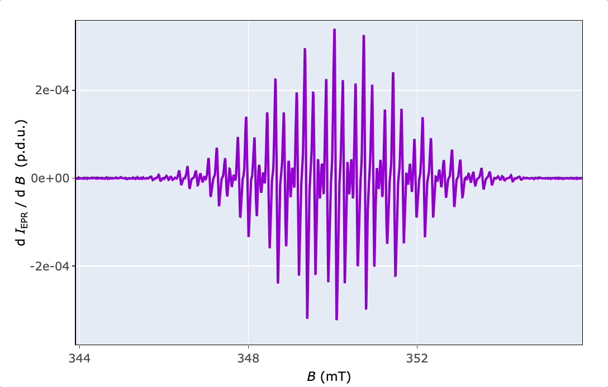
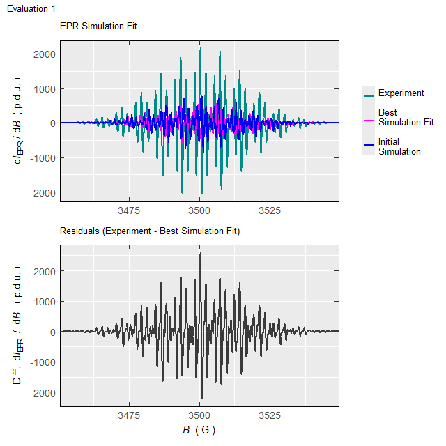

# Basic Functionality

\\\require{mhchem}\\

## 1 Introduction

The *Wuster’s* reagent got its name according to *C. Wuster* who
discovered the oxidation products of *p*-phenylenediamine derivatives
([1](#ref-GramppGpda2005)). It is a suitable compound to demonstrate the
feasibility of Electron paramagnetic resonance (EPR) combined with the
*in situ* electrochemistry/voltammetry because of the one-electron
oxidation ([2](#ref-PetrAse1996)):

\\\begin{equation} \small \ce{TMPD \<=\>\[-e^-\] TMPD^{.+}} \tag{1.1}
\end{equation}\\

where the \\\small \ce{TMPD}\\ stands for
*N,N,N’,N’*-tetramethyl-*p*-phenylenediamine (Wuster’s reagent)
abbreviation. The second oxidation step into di-cationic structure (not
depicted in Equation [(1.1)](#eq:tmpdoxid)) takes place far (\\\small
\approx (0.5-0.6)\\\mathrm{V}\\) from the first one
([3](#ref-Dadpou2018)). Therefore, upon the first oxidation step, it
changes its state from diamagnetic (not visible by EPR) to paramagnetic
(with one unpaired electron) observable by a characteristic EPR
spectrum, as shown below. Such change is not only visible by the “magic”
where the nicely structured EPR spectrum rises from the noisy background
upon oxidation, however, it is also associated with an exciting color
change from almost colorless to violet-blue. Accordingly and
unsurprisingly, **the radical cation of
*N,N,N’,N’*-tetramethyl-*p*-phenylenediamine is** described as
***Wuster’s*** **blue**. Such example will demonstrate the main workflow
to process and analyse EPR spectra by the
[eprscope](https://jatanrt.github.io/eprscope/) 📦 . The \\\small
\ce{TMPD^{.+}}\\ was generated electrochemically by potentiostatic
electrolysis at 0.308 V (*vs* Ag-*quasiref.* electrode) of the
corresponding \\\small 1\\\mathrm{mM}\\ \\\small \ce{TMPD}\\ solution in
\\\small 0.3\\\mathrm{M}\\\\\ce{TBAPF6}/\ce{DMSO}\\.

## 2 Drawing of Molecular Structures

Structure of the investigated compound can be depicted by the
[`draw_molecule_by_rcdk()`](https://jatanrt.github.io/eprscope/reference/draw_molecule_by_rcdk.md)
based on function coming from [{rcdk}](https://cdk-r.github.io/cdkr/) 📦
(see also ([4](#ref-GuhaRrcdk2007))) which is an 
toolbox of the [Chemistry Development Kit](https://cdk.github.io/), an
open source modular java library for chemoinformatics
([5](#ref-WillighagenCDK2017)).

``` r

# radical cation Wuster's Reagent equivalent
# to N,N,N',N'-tetramethyl-p-phenylenediamine (TMPD) radical cation
# from 'SMILES' origin on "cob" ("color on black") canvas, without
# suppressing the hydrogen atoms
draw_molecule_by_rcdk(
  molecule = "CN(C)[C+]1C([H])=C([H])[C.]([N](C)C)C([H])=C1[H]",
  type = "smiles",
  style = "cob",
  mol.label = expression(TMPD^+. ~ "(" ~ Wuster * "'" * s ~ Blue ~ ")"),
  mol.label.color = "yellow",
  suppressh = FALSE
)
```


This function belongs to the package family/section
`Visualizations and Graphics` and enables to create image of molecular
structures either by [SMILES and SMART
codes](https://chem.libretexts.org/Courses/Fordham_University/Chem1102%3A_Drug_Discovery_-_From_the_Laboratory_to_the_Clinic/05%3A_Organic_Molecules/5.08%3A_Line_Notation_(SMILES_and_InChI))
or by loading a **S**tructure **D**ata **F**ile (`.sdf`)
([6](#ref-Sakari2022)).

## 3 Reading Files and Writing Data Frames

The [eprscope](https://jatanrt.github.io/eprscope/) reads and converts
pure (except the `.mat` format) text files. Therefore, to read the
instrumental data files, recorded EPR spectra must be first converted
into the ASCII format at the spectrometer. If the conversion option is
not available, one can also try a free online converter by *Leland B.
Gee* ([7](#ref-xepr2gfac2023)). To process the EPR spectral data, it is
important not only to read the files with *Intensity vs. B* (usually in
`.asc`, `.txt`, `.csv` format) but also associated files like those
containing the instrumental parameters used to record the EPR spectra
(usually in `.DSC` , `.dsc` or `.par` format). The information including
in these files is required to e.g. normalize the Intensity (like
\\\small \mathrm{d}I\_{\mathrm{EPR}}~/~\mathrm{d}B\\ in the derivative
spectral form) or to evaluate the \\g\\-factor (position of the
spectrum) as well as for simulations of the EPR spectra and to evaluate
the kinetic parameters of the radical reactions.

Reading of the instrumental parameters from `.DSC` / `.dsc` or `.par`
files (corresponding to acquisition software “xenon”/“magnetech” or
“winepr”, respectively) is provided by several functions for different
purposes e.g. for kinetic measurements or simulations. The general
function
[`readEPR_params_tabs()`](https://jatanrt.github.io/eprscope/reference/readEPR_params_tabs.md)
summarizes all important parameters in a list of data frames and can be
converted into individual interactive tables by
[{DT}](https://rstudio.github.io/DT/) package ➨

``` r

# package built-in example file => "TMPD_specelchem_accu_b.par"
tmpd.params.file <- 
  load_data_example(file = "TMPD_specelchem_accu_b.par")
#
# reading the parameter file coming from "winepr" acquisition softw.
tmpd.params <- readEPR_params_tabs(
  path_to_dsc_par = tmpd.params.file,
  origin = "winepr"
)
#
# the output `tmpd.params` is a list consisting
# of the "info" data frame (contaning characters)
tmpd.params$info # or `tmpd.params[["info"]]`
#>                 Parameter
#> 1                Operator
#> 2                    Date
#> 3          Recording Time
#> 4                 Comment
#> 5        Experiment Title
#> 6 X Var. (e.g. B/RF) Unit
#>                                                         Information
#> 1                                                           Tarabek
#> 2                                                        08/01/2011
#> 3                                                             15:15
#> 4 Q=3500, 1mM solut. tetramethyl phenylene diamine, accu 20 spectra
#> 5                                                       field-sweep
#> 6                                                                 G
```

``` r

# and the second data frame is the "params",
# containing parameters, their values and units
tmpd.params$params # or `tmpd.params[["params"]]`
#>               Parameter        Value     Unit
#> 1             Frequency     9.814155      GHz
#> 2         Central Field  3499.170000        G
#> 3           Sweep Width   120.000000        G
#> 4  Modulation Amplitude     0.500000        G
#> 5       Number of Scans    20.000000 Unitless
#> 6      Number of Points  2401.000000 Unitless
#> 7                 Power     5.024000       mW
#> 8       Conversion Time     0.008000        s
#> 9            Sweep Time    19.208000        s
#> 10         Acquire Time   384.160000        s
#> 11        Time Constant     0.005120        s
#> 12          Temperature   295.068344        K
#> 13        Receiver Gain 39905.250000 Unitless
```

Finally, conversion of the second data frame (`tmpd.params$params`) can
be performed by the
[`readEPR_params_tabs()`](https://jatanrt.github.io/eprscope/reference/readEPR_params_tabs.md)
function with the argument `interact = "params"` .

The `origin` argument in reading functions reflects the differences in
ASCII text file structure depending on the acquisition software.
Moreover, while the intensity can be automatically normalized upon
spectrum recording within “xenon”/“magnetech” software, the “winepr”
intensity has to be normalized after the measurement if one wants to
compare the intensities of two or several EPR spectra. The reading of
the \\\small \ce{TMPD^{.+}}\\ spectral data by
[`readEPR_Exp_Specs()`](https://jatanrt.github.io/eprscope/reference/readEPR_Exp_Specs.md)
proceeds as follows with the output having the form of the universal
`data frame` format ➨

``` r

# loading package built-in example file => "TMPD_specelchem_accu_b.asc"
tmpd.data.file <- load_data_example(file = "TMPD_specelchem_accu_b.asc")

# intensity is normalized by the Q value (sensitivity factor)
# and the number of scans (`Nscans`). From the previous 
# parameter/info reading we know: Q = 3500 (in the `info` 
# data frame), Nscans = 20 (from `tmpd.params$params` 
# in the 5th row and the 2nd column)
tmpd.data.norm.01 <- readEPR_Exp_Specs(
  path_to_ASC = tmpd.data.file,
  col.names = c("B_G", "dIepr_over_dB"),
  qValue = 3500,
  norm.vec.add = tmpd.params$params[5,2],
  origin = "winepr"
)
#
# preview of the first six rows
head(tmpd.data.norm.01)
#>          B_G dIepr_over_dB      B_mT
#>        <num>         <num>     <num>
#> 1: 3439.1699 -2.8023680804 343.91699
#> 2: 3439.2200 -1.5253253348 343.92200
#> 3: 3439.2700 -1.9261109375 343.92700
#> 4: 3439.3201  0.0019604213 343.93201
#> 5: 3439.3701 -4.6310111607 343.93701
#> 6: 3439.4199 -3.5957537946 343.94199
```

An arbitrary character string may be chosen for the column name (see
`col.names` argument)[¹](#fn1). However, a safe rule of thumb is to use
notation like “quantity_unit” as already shown above in the case of
magnetic flux density \\\small B\\. The name for the intensity column
reads `dIepr_over_dB` (without units) because it reflects the derivative
mode \\\small \mathrm{d}I\_{\mathrm{EPR}}/\mathrm{d}B\\ in CW
(continuous wave) EPR. Other intensity related column names can be used
as well. The above described function
[`readEPR_Exp_Specs()`](https://jatanrt.github.io/eprscope/reference/readEPR_Exp_Specs.md)
can automatically convert \\\small B\\ values by the argument
`convertB.unit=TRUE` (or `FALSE`) depending on the original units “G” or
“mT”. The reason is, that both units are quite often used to display the
EPR spectra as well as to calculate the additional related quantities
like \\\small \Delta B\\, \\g\\ or hyperfine splitting constants \\a\\.
If the `Intensity` has to be normalized also by additional instrumental
parameters, like *conversion time* and *receiver gain* (automatically
performed within “Xenon” software)*,* one should use the
[`quantify_EPR_Norm_const()`](https://jatanrt.github.io/eprscope/reference/quantify_EPR_Norm_const.md)
function from the `Evaluations and Quantification` family ➨

``` r

# calculation of the advanced normalization constant
# by selected parameters from the parameter list above,
# these parameters (WinEPR acq. spectrometer software)
# can be also obtained by the `readEPR_param_slct()`
# function with the codes described in the corresponding
# documentation
#
# following parameters are required (`req.params`) =>
# conversion time (RCT) in milliseconds, receiver gain (RRG) 
# unitless, sweep with (HSW) in Gauss, number of points (RES) 
# and number of scans/accumulations (JSD).
#
req.params <-
  readEPR_param_slct(tmpd.params.file,
    string = c("RCT", "RRG", "HSW", "RES", "JSD"),
    origin = "winepr"
  )
#
adv.norm.constant <- quantify_EPR_Norm_const(
  conv.time.ms = req.params$RCT,
  Nscans = req.params$JSD,
  Npoints = req.params$RES,
  rg = req.params$RRG,
  rg.unit = "Unitless",
  Bsw = req.params$HSW
)
#
# therefore, the reading of the experimental
# data file =>
tmpd.data.norm.02 <- readEPR_Exp_Specs(
  path_to_ASC = tmpd.data.file,
  col.names = c("B_G", "dIepr_over_dB"),
  qValue = 3500,
  norm.vec.add = adv.norm.constant,
  origin = "winepr"
)
#
# data frame preview
head(tmpd.data.norm.02)
#>          B_G  dIepr_over_dB      B_mT
#>        <num>          <num>     <num>
#> 1: 3439.1699 -4.3890968e-07 343.91699
#> 2: 3439.2200 -2.3889797e-07 343.92200
#> 3: 3439.2700 -3.0166941e-07 343.92700
#> 4: 3439.3201  3.0704314e-10 343.93201
#> 5: 3439.3701 -7.2531358e-07 343.93701
#> 6: 3439.4199 -5.6317054e-07 343.94199
```

Moreover, the `norm.vec.add` argument can involve additional
normalization quantities like sample weight, concentration, number of
scans (if not normalized by the spectrometer)…etc. If needed, all such
quantities can be defined at once within the `norm.vec.add` .

Visualization and/or conversion of data frames (tables) into several
formats like `.html` , `.pdf` , `.docx` or `.pptx`. can be provided by
the most used [“table”
packages](https://rfortherestofus.com/2019/11/how-to-make-beautiful-tables-in-r/).
Among them, libraries/packages like
[{DT}](https://rstudio.github.io/DT/),
[{flextable}](https://davidgohel.github.io/flextable/index.html),
[{gt}](https://gt.rstudio.com/),
[{tinytable}](https://vincentarelbundock.github.io/tinytable/) and
[{kableExtra}](https://haozhu233.github.io/kableExtra/) (see Section
[5.3](#hf-structure) below) are often used for publication ready table
visualization. The last data frame previewed by the
[tinytable](https://vincentarelbundock.github.io/tinytable/) is shown in
the following example.

``` r

# visualization of the first 10 rows by `{tinytable}` 
tinytable::tt(head(tmpd.data.norm.02, n = 10))
```

| B_G       | dIepr_over_dB  | B_mT      |
|-----------|----------------|-----------|
| 3439.1699 | -4.3890968e-07 | 343.91699 |
| 3439.2200 | -2.3889797e-07 | 343.92200 |
| 3439.2700 | -3.0166941e-07 | 343.92700 |
| 3439.3201 | 3.0704314e-10  | 343.93201 |
| 3439.3701 | -7.2531358e-07 | 343.93701 |
| 3439.4199 | -5.6317054e-07 | 343.94199 |
| 3439.4700 | -7.1400107e-07 | 343.94700 |
| 3439.5200 | -9.6621681e-07 | 343.95200 |
| 3439.5701 | -1.3318550e-07 | 343.95701 |
| 3439.6201 | 8.6338939e-07  | 343.96201 |

In order to process data frames by other software tools, different from
 (e.g. in excel-like sheet format), they might be
exported into universal `.csv` table format like by the
`base::write.csv()` function ➨

``` r

write.csv(tmpd.data.norm.02,
  file = "TMPD_EPR_Norm_data02.csv",
  row.names = FALSE
  )
```

## 4 Visualizations of Spectral Data

All the data related to EPR spectroscopy can be visualized by the
[{ggplot2}](https://ggplot2.tidyverse.org/) 📦 and its
[extensions](https://exts.ggplot2.tidyverse.org/gallery/) as well as by
the interactive [{plotly}](https://plotly.com/r/) graphing library.
While the first library/package (based on the “Grammar of
Graphics”[²](#fn2) , see also ([8](#ref-WilkinsonGG2005))) is one of the
most comprehensive system for data visualization, the second one
represents a valuable alternative to processing/acquisition software at
EPR spectrometers. Namely, it includes tools like zooming, panning,
data/values hovering and [much
more](https://plotly.com/r/configuration-options/). Combination of both
approaches actually represents literally endless possibilities how to
visualize the data in electron paramagnetic resonance spectroscopy.

### 4.1 Static Plots by `{ggplot2}` and `{patchwork}`

The
[`plot_EPR_Specs()`](https://jatanrt.github.io/eprscope/reference/plot_EPR_Specs.md)
is the essential function for plotting individual EPR spectra as well as
those within series (e.g. time series \\\equiv\\ kinetic measurements).
Now, by means of this function and by the
[{patchwork}](https://patchwork.data-imaginist.com/) 📦 , we can compare
the EPR spectra with the basic and “advanced” normalization ➨

``` r

# plotting the spectrum with basic normalization,
# the B-axis can be presented either 
# in "mT" (default) or "G" plot title is added 
# by `ggtitle()` function from `{ggplot2}` package
tmpd.plot.norm.01 <-
  plot_EPR_Specs(data.spectra = tmpd.data.norm.01) +
  ggplot2::ggtitle("Basic Normalization")
#
# preview
tmpd.plot.norm.01
```


Figure 4.1: EPR spectrum of \\\small \ce{TMPD^{.+}}\\ in \\\small
0.3\\\mathrm{M}~\ce{TBAPF6}/\ce{DMSO}\\ after potentiostatic oxidative
electrolysis at \\\small 0.308\\\mathrm{V}\\ vs Ag-quasiref. Intensity
normalized by number of scans, ‘Nscans’, and by sensitivity Q-factor,
‘qValue’.

Comparison of both spectra with different normalization ➨

``` r

# spectrum with the "advanced" normalization
tmpd.plot.norm.02 <-
  plot_EPR_Specs(data.spectra = tmpd.data.norm.02) +
  ggplot2::ggtitle("Advanced Normalization")
#
# both spectra together side-by-side by `{patchwork}` package,
# see https://patchwork.data-imaginist.com/articles/guides/layout.html
tmpd.plot.norm.0102 <-
  tmpd.plot.norm.01 +
  tmpd.plot.norm.02 +
  patchwork::plot_layout(
    ncol = 2,
    axis_titles = "collect"
  )
#
# preview of EPR spectra with different intensities
tmpd.plot.norm.0102
```


Figure 4.2: Comparison of \\\small \ce{TMPD^{.+}}\\ EPR spectra with
different intensity normalization.

If one wants to save the previous Figure
[4.2](#fig:spectral-data-norm0102-visual), the function
[`ggplot2::ggsave()`](https://ggplot2.tidyverse.org/reference/ggsave.html)
can be applied ➨

``` r

# to save the plot `tmpd.plot.norm.0102` with the size
# of (7 x 5) inches and the resolution of dpi = 200
ggplot2::ggsave("TMPD_EPR_Norm_compar.png",
  plot = tmpd.plot.norm.0102,
  width = 7,
  height = 5,
  units = "in",
  dpi = 200
)

# other image formats like `.pdf`, `.tex`,`.jpeg`, `.eps`,
# `.bmp`, `.svg` or `.tiff` can be used as well
```

### 4.2 Interactive Plots by `{plotly}`

In order to explore the EPR spectrum in details (to read values, zoom or
save the spectrum), functions like
[`plot_EPR_Specs2D_interact()`](https://jatanrt.github.io/eprscope/reference/plot_EPR_Specs2D_interact.md)
or
[`plot_eval_ExpSim_app()`](https://jatanrt.github.io/eprscope/reference/plot_eval_ExpSim_app.md)
are applied (consult the corresponding examples in the function
documentation). Additionally, it can be also used for a series of EPR
spectra, in overlay mode, similarly to
[`plot_EPR_Specs()`](https://jatanrt.github.io/eprscope/reference/plot_EPR_Specs.md).
Additional interactive 3D-plotting of EPR spectra, especially those
recorded as time series, like during kinetic or variable temperature
experiments, are provided by the
[`plot_EPR_Specs3D_interact()`](https://jatanrt.github.io/eprscope/reference/plot_EPR_Specs3D_interact.md)
function.



## 5 Basic EPR Spectral Characteristics

There are four basic parameters to characterize the EPR spectrum ➨

1.  Spectrum position expressed by the \\g\_{\mathrm{iso}}\\-value

2.  Linewidth, for derivative line form expressed by the \\\small \Delta
    B\_{\mathrm{pp}}\\, that is the difference between \\\small
    B\_{\mathrm{max}}\\ and \\\small B\_{\mathrm{min}}\\ corresponding
    to position of maximum and minimum intensity, respectively. For the
    integrated spectral form, the linewidth is expressed by the \\\small
    FWHM\\ (“full width at half-maximum” or “full width at
    half-height”).

3.  Hyperfine splitting, \\a\\ (in \\\mathrm{m \small T}\\ or \\\small
    \mathrm{G}\\) which is the distance between the individual lines
    corresponding to interaction of the unpaired electron with the group
    of surrounding equivalent nuclei.

4.  Single or double integral depending on the original spectral line
    form ➨ either integrated or derivative. This is directly
    proportional to the number of paramagnetic species/radicals.

### 5.1 Finding the *g*_(iso)-Value

The parameter is defined by the following Equation [(5.1)](#eq:gfactor):

\\\begin{equation} \small g\_{\mathrm{iso}} =
\frac{h\\\nu}{\mu\_{\mathrm{B}}\\B_0} \tag{5.1} \end{equation}\\

where the \\h\\ and \\\mu\_{\mathrm{B}}\\ are Plank’s and Bohr magneton
constants, respectively. Therefore, it is determined only by the
microwave frequency (\\\nu\\) and the magnetic flux density (\\\small
B_0\\) of the spectrum mid-point where \\\small
\mathrm{d}I\_{\mathrm{EPR}}/\mathrm{d}B = 0\\ (in the case of CW EPR
spectra, see also function
[`eval_gFactor_Spec()`](https://jatanrt.github.io/eprscope/reference/eval_gFactor_Spec.md)).

``` r

# reading the microwave frequency ("MF") from the `.par` file
tmpd.mw.freq <-
  readEPR_param_slct(tmpd.params.file,
    string = "MF",
    origin = "winepr"
  )
# B region (349.677, 350.457) mT, including 
# the B mid-point, to calculate the g-value, 
# is obtained from the interactive plot above
tmpd.g.iso.spec <-
  eval_gFactor_Spec(tmpd.data.norm.02,
    nu.GHz = tmpd.mw.freq,
    B = "B_mT",
    B.unit = "mT",
    Blim = c(349.677, 350.457)
  )
#
# value preview
tmpd.g.iso.spec
#> [1] 2.00304
```

Function
[`plot_eval_ExpSim_app()`](https://jatanrt.github.io/eprscope/reference/plot_eval_ExpSim_app.md)
represents an alternative way how to figure out the *g*-value. Within a
simple UI (**u**ser **i**nterface), based on [*R*
Shiny](https://shiny.posit.co/r/gallery/), one can interactively display
the EPR spectrum as well as its corresponding instrumental parameters.
If the **“Microwave frequency (GHz)”** is available (the function
automatically reads the right frequency by loading the “parameter” file
with `.par` or `.dsc`/ `.DSC` extensions), by activating the **“Show
g-Values”**. Immediately after that, the EPR spectrum abscissa is
automatically converted from *B* into *g* (see Figure
[5.1](#fig:g-value-shiny-app)).


Figure 5.1: Screenshot of the interactive Shiny app, showing how to
display g-values for the \\\small \ce{TMPD^{.+}}\\ EPR spectrum.

The above (from the EPR spectrum)-obtained \\g\_{\mathrm{iso}}\\-value
may be compared with that computed by the Density Functional Theory
(DFT) quantum chemical calculations of \\\small \ce{TMPD^{.+}}\\, namely
by PBE0/EPR-II/CPCM-DMSO//B3LYP/6-31+G(d,p) (see also [Gaussian DFT
Methods](https://gaussian.com/dft/) and [Basis
Sets](https://gaussian.com/basissets/)). The extraction of
\\g\_{\mathrm{iso}}\\-value from the *Gaussian* (or from the [ORCA
quantum chemical
package](https://www.orcasoftware.de/tutorials_orca/index.html)) output
file is provided by the
“[`eval_gFactor_QCHcomp()`](https://jatanrt.github.io/eprscope/reference/eval_gFactor_QCHcomp.md)
function ➨

``` r

# package built-in example file => 
# "TMPDAradCatEPRa.inp.log.zip"
# which is a `.zip` of the Gaussian output file
gauss.tmpd.load <- 
  load_data_example(file = "TMPDAradCatEPRa.inp.log.zip")
gauss.tmpd.output <- unzip(gauss.tmpd.load)
#
# giso-value is automatically calculated as the mean
# of its principal components (g1,g2,g3) 
# summarized in the output file
tmpd.g.iso.dft <- 
  eval_gFactor_QCHcomp(gauss.tmpd.output)
#
# preview
tmpd.g.iso.dft
#> [1] 2.00317
#
# comparison of both theoretical and experimental g-values
# within the tolerance of 1e-3, to illustrate the automatic
# comparison of two values in R language, the function 
# `all.equal()`can be applied
all.equal(tmpd.g.iso.spec, tmpd.g.iso.dft, tolerance = 1e-3)
#> [1] TRUE
```

The `TRUE` value represents a perfect agreement between the
theoretically (`2.00317`) and the experimentally (`2.00304`) determined
\\g\_{\mathrm{iso}}\\-values, thus supporting the structure of \\\small
\ce{TMPD^{.+}}\\. Its difference from the free electron
\\g\_{\mathrm{e}}\approx \small 2.00232\\ is a consequence of
[spin-orbit coupling
(SOC)](https://chem.libretexts.org/Bookshelves/Physical_and_Theoretical_Chemistry_Textbook_Maps/Electron_Paramagnetic_Resonance_(Jenschke)/03%3A_Electron_Zeeman_Interaction/3.01%3A_Physical_origin_of_the_(g)_shift)
of the unpaired electron within the radical cation. Namely, it tells how
the individual atomic orbitals contribute to single occupied molecular
orbital (SOMO), i.e. the orbital characterizing the unpaired electronic
state. Therefore, for \\\small \ce{TMPD^{.+}}\\ the SOC is not so
pronounced because of the small difference from \\g\_{\mathrm{e}}\\.
However, for heavy atoms (e.g. central atoms in metal complexes) the
difference is often large and indicates larger SOC than for organic
radicals like for the one mentioned above ([9](#ref-Weilepr2007)).

### 5.2 Linewidth, 𝚫*B*_(pp) Determination

The linewidth in \\\mathrm{m\small T}\\ can be determined from several
spectral lines/regions from the interactive plots above and by the
[`eval_DeltaXpp_Spec()`](https://jatanrt.github.io/eprscope/reference/eval_DeltaXpp_Spec.md)
function ➨

``` r

# calculate Delta Bpp from several regions
# => list of three selected elements/regions
B.regions.mT <- list(
  c(349.677, 349.977),
  c(349.177, 349.492),
  c(350.822, 351.072)
)
#
# all Delta Bpp as vector, created by the iteration 
# through all elements (with the help of 
# the `sapply()` function) of `B.regions.mT`
tmpd.delta.Bpp <- sapply(
  B.regions.mT,
  function(b) {
    eval_DeltaXpp_Spec(tmpd.data.norm.02,
      xlim = b
    )
  }
)
#
# mean value of all three linewidths in mT
tmpd.delta.Bpp.mean <-
  round(mean(tmpd.delta.Bpp), digits = 2)
#
# value preview
tmpd.delta.Bpp.mean
#> [1] 0.05
```

### 5.3 Hyperfine (HF) Structure and Simulations

The **HF** structure represents one of the most important characteristic
of EPR spectra because it reflects the distribution of unpaired electron
density within the radical/paramagnetic molecule. At least some of the
hyperfine splitting constants (\\a\\, HFSCs, distance between the main
lines within the pattern) may be estimated from the interactive EPR
spectrum above. For the subsequent simulation of the EPR spectrum these
are simply converted by the
[`convert_a_mT_2A()`](https://jatanrt.github.io/eprscope/reference/convert_a_mT_2A.md)
into hyperfine coupling constants in \\\mathrm{\small{MH}z}\\ (\\\small
A\\, HFCCs) using the following relation (Equation [(5.2)](#eq:hfatoA))
➨

\\\begin{equation} \small A = \frac{a\\g\\\mu\_{\mathrm{B}}}{h}
\tag{5.2} \end{equation}\\

``` r

# two visible distances or HFSCs (a in mT)
# from the interactive EPR spectrum above
a1.guess.mT <- abs(350.042 - 349.342)
a2.guess.mT <- abs(349.147 - 349.342)
# both values into vector
a.guess.mT <- c(a1.guess.mT, a2.guess.mT)
#
# conversion into A (in MHz) incl. g.iso value
# (`tmpd.g.iso.spec`) from the calculation above
A.guess.MHz <-
  sapply(
    a.guess.mT,
    function(x) {
      convert_a_mT_2A(
        a.mT = x,
        g.val = tmpd.g.iso.spec
      )
    }
  )
#
# `A.guess.MHz` preview
A.guess.MHz
#> [1] 19.62  5.47
```

According to literature ([1](#ref-GramppGpda2005)) and the \\\small
\ce{TMPD^{.+}}\\ structure (see also Figure
[5.2](#fig:dft-tmpd-structure) with the DFT-optimized geometry), one can
recognize three interacting groups of equivalent nuclei : \\\small
2\\\times\\\ce{^{14}N}\\, \\\small 4\\\times\\\ce{^1H}\\ (aromatic
protons) and \\\small 12\\\times\\\ce{^1H}\\ (methyl protons). DFT
calculations may provide all \\\small A\\ (HFCCs) as shown below.


Figure 5.2: DFT optimized structure of TMPD radical cation with atom
numbering inherited from the Gaussian 16 output file.

In order to compare the theoretical and experimental HFCCs, the function
[`rearrange_aAiso_QCHorgau()`](https://jatanrt.github.io/eprscope/reference/rearrange_aAiso_QCHorgau.md)
extracts the \\\small A\\ values from the Gaussian or
[ORCA](https://www.orcasoftware.de/tutorials_orca/index.html) output
files and calculates the mean values corresponding to selected groups of
equivalent nuclei which are defined by the `nuclei.list.slct` argument.
Therefore, according to numbering shown in Figure
[5.2](#fig:dft-tmpd-structure) ➨

``` r

# The same package built-in example file 
# (`TMPDAradCatEPRa.inp.log.zip`)
# as for the extraction of g-values is (see above).
symmetry.As.df <-
  rearrange_aAiso_QCHorgau(gauss.tmpd.output,
    nuclei.list.slct =
      list(
        c(7, 8), # 2 x 14N
        c(13, 14, 15, 16), # 4 x 1H (aromatic)
        c(
          17, 18, 19, 20,
          21, 22, 23, 24,
          25, 26, 27, 28
      ) # 12 x 1H (methyls)
    )
  )
#
# data frame presentation by `{kableExtra}` package
kableExtra::kbl(symmetry.As.df) %>%
  kableExtra::kable_styling(
    bootstrap_options = 
      c("striped",
        "hover",
        "condensed"
  )
)
```

| NuclearGroup                                  | Aiso_MHz | aiso_mT |
|:----------------------------------------------|---------:|--------:|
| 12 x 1H (17,18,19,20,21,22,23,24,25,26,27,28) |    20.25 |    0.72 |
| 2 x 14N (7,8)                                 |    17.52 |    0.63 |
| 4 x 1H (13,14,15,16)                          |    -5.24 |   -0.19 |

The previous analysis reveals that the highest HF-coupling/splitting
constants are related to the interaction of unpaired electron with the
nitrogen and methyl-proton nuclei. Therefore the highest spin density is
located on the “periphery” of the \\\small \ce{TMPD^{.+}}\\ molecule.
This may be also supported by the simulation (theoretical calculation)
of the EPR spectrum (which is computed by the
[`eval_sim_EPR_iso()`](https://jatanrt.github.io/eprscope/reference/eval_sim_EPR_iso.md)
function), taking into account the following parameters ➨

- position of the EPR spectrum (\\g\_{\mathrm{iso}}\\-value) ➨ `g.iso`

- spectral linewidth corresponding to Gaussian and/or Lorentzian
  lineshape ➨ `lineGL.DeltaB`

- content of the Gaussian lineshape in the overall linear combination of
  both Gaussian and Lorenztian theoretical spectral forms (so called
  pseudo-Voigt lineshape) ➨ `lineG.content`

- additional instrumental parameters like central field ➨ `Bcf`, sweep
  width ➨ `Bsw`, microwave frequency ➨ `mwGHz` and number of points
  (spectral resolution) ➨ `Npoints`.

Required arguments of the
[`eval_sim_EPR_iso()`](https://jatanrt.github.io/eprscope/reference/eval_sim_EPR_iso.md)
function are presented after the arrows. The estimated linewidth
`tmpd.delta.Bpp.mean` (\\\small 0.5\\\mathrm{G}\\, see above) as well as
the HFCCs, either directly taken from the spectrum (`A.guess.MHz`) or
from the quantum chemical calculations (`symmetry.As.df`) and/or from
the literature ([1](#ref-GramppGpda2005)), can be used to simulate the
EPR spectrum of \\\small \ce{TMPD^{.+}}\\ as follows ➨

``` r

# isotropic simulation of the TMPD radical cation where
# the instrumental parameters are taken from 
# the corresponding `.par` file: `tmpd.params.file` :
system.time({ # time (in s) reserved for the simulation processing
sim.tmpd.iso <-
  eval_sim_EPR_iso(
    g.iso = tmpd.g.iso.spec,
    instrum.params = NULL,
    path_to_dsc_par = tmpd.params.file,
    origin = "winepr",
    B.unit = "mT",
    nuclear.system =
      list(
        list("14N", 2, 18.6), # A(2 x 14N) = 18.6 MHz
        list("1H", 4, 5.5), # A(4 x 1H) = 5.5 MHz
        list("1H", 12, 19.6) # A(12 x 1H) = 19.6 MHz
      ), 
    # Gauss (G) & Lorentz (L) linewidth (mT):
    lineGL.DeltaB = list(0.05, 0.05),
    # pseudo-Voigt line shape with 0.5 G + 0.5 L:
    lineG.content = 0.5
  )
})
#>    user  system elapsed 
#>   0.102   0.000   0.102
#
# output is either interactive spectrum plot
# or list of plot and the simulated 
# spectrum data frame.
#
# data frame preview
head(sim.tmpd.iso$df)
#>    Bsim_G Bsim_mT   Bsim_T dIeprSim_over_dB
#> 1 3439.17 343.917 0.343917    9.6281321e-07
#> 2 3439.22 343.922 0.343922    9.6721842e-07
#> 3 3439.27 343.927 0.343927    9.7169711e-07
#> 4 3439.32 343.932 0.343932    9.7625349e-07
#> 5 3439.37 343.937 0.343937    9.8089217e-07
#> 6 3439.42 343.942 0.343942    9.8561824e-07
```

Afterwards, the simulated EPR spectrum can be presented/compared with
the experimental one by the
[`present_EPR_Sim_Spec()`](https://jatanrt.github.io/eprscope/reference/present_EPR_Sim_Spec.md)
function (Figure [5.3](#fig:tmpd-radcat-sim-expr-compar)), which is
essentially based on [ggplot2](https://ggplot2.tidyverse.org) package
and therefore can be combined with the [additional {ggplot2}
functions](https://ggplot2.tidyverse.org/reference/index.html) . Such
simulation of the \\\small \ce{TMPD^{.+}}\\ EPR spectrum can be also
performed by an interactive manner using the above-mentioned
[`plot_eval_ExpSim_app()`](https://jatanrt.github.io/eprscope/reference/plot_eval_ExpSim_app.md)
. One can “play” with all the simulation parameters defined above and
the simulated EPR spectrum is instantaneously updated and compared with
the experimental one like depicted on Figure
[5.4](#fig:simulation-shiny-app).

``` r

# intesinty of the simulated spectrum
# is automatically scalled onto 
# the experimental one.
present_EPR_Sim_Spec(
  data.spectr.expr = tmpd.data.norm.02,
  data.spectr.sim = sim.tmpd.iso$df,
  B.unit = "mT",
  Blim = c(345,355)
  ) +
  # `plot_theme_NoY_ticks` theme from `{eprscope}`
  plot_theme_NoY_ticks(legend.text = element_text(size = 13))
```


Figure 5.3: Comparison of simulated and experiental EPR spectrum of
\\\small \ce{TMPD^{.+}}\\.


Figure 5.4: Screenshot of the Shiny app, showing an interactive
simulation of the \\\small \ce{TMPD^{.+}}\\ EPR spectrum.

Even though the simulated \\\small \ce{TMPD^{.+}}\\ EPR spectrum is
quite close to the experimental one, there are still some apparent
differences. Therefore, the fitting/optimization functions like
[`eval_sim_EPR_isoFit()`](https://jatanrt.github.io/eprscope/reference/eval_sim_EPR_isoFit.md)
and/or
[`eval_sim_EPR_isoFit_space()`](https://jatanrt.github.io/eprscope/reference/eval_sim_EPR_isoFit_space.md)
can be applied to get a more accurate simulated spectrum. Particularly,
the latter can explore a broad range of initial simulation parameters in
order to fit and analyze an isotropic EPR spectrum, like the \\\small
\ce{TMPD^{.+}}\\ one, described in the following example.

``` r

# runnig parallel processing 
# to fit the EPR spectrum of the TMPD 
# radical cation + zoom the spectrum output 
# by `Blim` argument, refer to the documentation 
# of `eval-sim_EPR_isoFit_space`
tmpd.epr.iso.fit <- 
  eval_sim_EPR_isoFit_space(
    data.spectr.expr = tmpd.data.norm.01,
    nu.GHz = tmpd.params$params[1,2],
    nuclear.system.noA = list(
      list("14N", 2), # 2 x 14N
      list("1H", 4), # 4 x 1H
      list("1H", 12) # 12 x 1H
    ),
    optim.params.init = c(
      2.0030, 0.4, 0.4, 0, 
      1.25e4, 20.0, 5.5, 19
    ),
    optim.params.init.dvary = 
      c(0.0002,0.1,0.1,0,
        2e3,2,1,2), # or NULL
    # Nmax.evals = 256, 
    # default number of evaluations:
    # N.points.space = 16,
    # total number of iterations: 256 x 16 = 4096
    lineG.content = 0.3,
    lineG.content.dvary = 0.15,# or NULL
    # optim.method = "neldermead",
    processing = "parallel",# or "sequential"
    Blim = c(3455,3545)
  )
#
```

Such processing (with the elapsed time of \\\approx 220\\\mathrm{s}\\ on
10-years old 4-core-CPU/16GB-RAM workstation/running on two cores) will
not only return the above-defined list (`tmpd.epr.iso.fit` , see also
documentation of the
[`eval_sim_EPR_isoFit_space()`](https://jatanrt.github.io/eprscope/reference/eval_sim_EPR_isoFit_space.md)),
however also an animation, showing the progress of simulated EPR
spectrum fit at each `Evaluation` :



Animation corresponds to the following optimization of EPR simulation
parameters:

``` r

tmpd.epr.iso.fit$plot.optim.space
#
# the best `lineG.content` parameter:
tmpd.epr.iso.fit$best.lineG.content
```


Figure 5.5: Progress of the EPR simulation parameter optimization for
the \\\small \ce{TMPD^{.+}}\\ experimental spectrum, corresponding to
above-depicted animation.

Gaussian-line content, corresponding to RSS minimum: 0.27

### 5.4 Integration of the EPR Spectrum

Integration process in the analysis of EPR spectra is undoubtedly an
important operation because it mirrors the amount of paramagnetic
centers/radicals within the sample (see also
[`quantify_EPR_Abs()`](https://jatanrt.github.io/eprscope/reference/quantify_EPR_Abs.md)).
However, it is heavily dependent on the initial form of the EPR
spectrum, i.e. whether it is present either in derivative (usually in CW
EPR) or already integrated (usually in 1D pulsed EPR) form/shape. Hence,
the spectrum has to be integrated either twice or only once,
respectively. The core-function used for the integration is based on the
cumulative trapezoidal approximation, available from the
[{pracma}](https://github.com/cran/pracma) 📦
[`pracma::cumtrapz()`](https://rdrr.io/pkg/pracma/man/trapz.html)
([10](#ref-Rpracma2023)–[13](#ref-epperson2013intro)).

The relative error of the cumulative trapezoidal integration is minimal,
usually falling into the range of \\\small \langle 1-5\rangle\\\\\\ or
even lower depending on the spectrum resolution
([11](#ref-LibreMath2023), [13](#ref-epperson2013intro)). If the initial
EPR spectrum displays low signal-to-noise ratio, the integral required
for the quantitative analysis looses its sigmoid-shape ( see below an
example of such shape). Therefore, in such case, the best option is to
simulate the EPR spectrum and to evaluate the integral from that
spectrum (see e.g. the
[`quantify_EPR_Sim_series()`](https://jatanrt.github.io/eprscope/reference/quantify_EPR_Sim_series.md)
function). The big advantage of this method consists in graphical
representation of the corresponding integrals, i.e. the integration
process may be visually controlled in the same manner like within the
EPR spectrometer acquisitions/processing software (see also the
[`plot_EPR_Specs_integ()`](https://jatanrt.github.io/eprscope/reference/plot_EPR_Specs_integ.md)
function below). The integration of the EPR spectral data is essentially
provided by the
[`eval_integ_EPR_Spec()`](https://jatanrt.github.io/eprscope/reference/eval_integ_EPR_Spec.md)
and its application to the experimental \\\small \ce{TMPD^{.+}}\\
spectrum is documented by the following scripts ➨

``` r

# basic integration without baseline correction
# during the first integration.
tmpd.data.norm.02.integ <-
  eval_integ_EPR_Spec(
    data.spectr = tmpd.data.norm.02,
    B = "B_mT",
    B.unit = "mT",
    sigmoid.integ = TRUE
  )
#
# integration returns the original data frame
# with the additional integrals 
# `single_Integ` + `sigmoid_Integ`
#
# preview
head(tmpd.data.norm.02.integ)
#>          B_G  dIepr_over_dB      B_mT  single_Integ sigmoid_Integ
#>        <num>          <num>     <num>         <num>         <num>
#> 1: 3439.1699 -4.3890968e-07 343.91699 2.0128171e-06 0.0000000e+00
#> 2: 3439.2200 -2.3889797e-07 343.92200 1.9958553e-06 1.0031502e-07
#> 3: 3439.2700 -3.0166941e-07 343.92700 1.9823278e-06 1.9986707e-07
#> 4: 3439.3201  3.0704314e-10 343.93201 1.9747866e-06 2.9888990e-07
#> 5: 3439.3701 -7.2531358e-07 343.93701 1.9566436e-06 3.9727197e-07
#> 6: 3439.4199 -5.6317054e-07 343.94199 1.9245572e-06 4.9392357e-07
```

Both integrals, within the entire \\\small B\\-range, can be visualized
by the
[`plot_EPR_Specs_integ()`](https://jatanrt.github.io/eprscope/reference/plot_EPR_Specs_integ.md)
function from `Visualization and Graphics` family:

``` r

# both integrals are presented separately
# with their corresponding intensities automatically
# scaled onto the `y`-axis (defined by "free_y")
plot_EPR_Specs_integ(
  tmpd.data.norm.02.integ,
  slct.integs = c(
    "single_Integ",
    "sigmoid_Integ"
  ),
  B = "B_mT",
  B.unit = "mT",
  separate.integs = TRUE,
  separate.integ.scales = "free_y"
)
```


Figure 5.6: Single (`single_Integ`) and double (`sigmoid_Integ`)
integrated EPR spectrum of \\\small \ce{TMPD^{.+}}\\.

Obviously, the baseline of the single and double integrated \\\small
\ce{TMPD^{.+}}\\ EPR spectrum is somewhat distorted and must be
corrected. To fix the baseline distortion, the
[`eval_integ_EPR_Spec()`](https://jatanrt.github.io/eprscope/reference/eval_integ_EPR_Spec.md)
function contains corresponding arguments which control the baseline
approximation, under the complex peak, by a polynomial fit and provide
its subtraction from the single integrated spectrum to evaluate the
double/sigmoid integral more accurately ➨

``` r

# correction of the TMPD^{.+} EPR spectrum single
# integral by the 3rd degree polynomial
tmpd.data.norm.02.integCorr <-
  eval_integ_EPR_Spec(
    data.spectr = tmpd.data.norm.02,
    B = "B_mT",
    B.unit = "mT",
    correct.integ = TRUE,
    # peak region to correct the baseline:
    BpeaKlim = c(344.5, 355.5),
    # polynomial degree to fit baseline 
    # under the peak region:
    poly.degree = 3,
    sigmoid.integ = TRUE
  )
#
# preview of the integrals,
# data frame column of corrected integral
# is denoted as `single_Integ_correct`
plot_EPR_Specs_integ(
  tmpd.data.norm.02.integCorr,
  slct.integs = c(
    "single_Integ_correct",
    "sigmoid_Integ"
  ),
  B = "B_mT",
  B.unit = "mT",
  separate.integs = TRUE,
  separate.integ.scales = "free_y"
)
```


Figure 5.7: Corrected single and double integrated EPR spectrum of
\\\small \ce{TMPD^{.+}}\\ (see also Figure
[5.6](#fig:tmpd-basic-epr-integ-visual)).

Maximum value of the double/sigmoid integral 0.0024 can be used for the
estimation of \\\small \ce{TMPD^{.+}}\\ amount within the sample.

## References

1\.

GRAMPP, Günter, KELTERER, Anne-Marie, LANDGRAF, Stephan, SACHER,
Michael, NIETHAMMER, Dominique, TELO, João P., DIAS, Rui M. B. and
VIEIRA, Abel J. S. C. ESR and ENDOR Investigations on Various Wurster’s
Radical Cations in Solution. Experimental Results, Theoretical Ab
Initio, and DFT Calculations. *Monatsh. Chem.* 2005. Vol. 136, no. 4,
p. 519–536.
DOI [10.1007/s00706-004-0224-4](https://doi.org/10.1007/s00706-004-0224-4).

2\.

PETR, Andreas, DUNSCH, Lothar and NEUDECK, Andreas. In situ uv-vis esr
spectroelectrochemistry. *J. Electroanal. Chem.* 1996. Vol. 412, no. 1,
p. 153–158.
DOI [10.1016/0022-0728(96)04582-2](https://doi.org/10.1016/0022-0728(96)04582-2).

3\.

DADPOU, Bita, NEMATOLLAHI, Davood and SHARAFI-KOLKESHVANDI, Mahnaz.
Solvent effect on the electrochemical oxidation of
N,N,N\\{'}\\,N\\{'}\\-tetramethyl-1,4-phenylenediamine. New insights
into the correlation of electron transfer kinetics with dynamic solvent
effects. *J. Mol. Liq.* 2018. Vol. 253, p. 127–135.
DOI [10.1016/j.molliq.2017.12.151](https://doi.org/10.1016/j.molliq.2017.12.151).

4\.

GUHA, Rajarshi. Chemical informatics functionality in r. *J. Stat.
Softw.* 2007. Vol. 18, no. 6.

5\.

WILLIGHAGEN, Egon L., MAYFIELD, Jonathan, John W.and Alvarsson, BERG,
Arvid, CARLSSON, Lars, JELIAZKOVA, Nina, KUHN, Stefan, PLUSKAL, Tomáš,
ROJAS-CHERTÓ, Miquel, SPJUTH, Ola, TORRANCE, Gilleain, EVELO, Chris T.,
GUHA, Rajarshi and STEINBECK, Christoph. The chemistry development kit
(CDK) v2.0: Atom typing, depiction, molecular formulas, and substructure
searching. *J. Cheminformatics*. 2017. Vol. 9, no. 1, p. 33.
DOI [10.1186/s13321-017-0220-4](https://doi.org/10.1186/s13321-017-0220-4).

6\.

LÄTTI, Sakari T., NIINIVEHMAS, Sanna and PENTIKÄINEN, Olli T. Sdfconf: A
novel, flexible, and robust molecular data management tool. *J. Chem.
Inf. Model.* 2022. Vol. 62, no. 1, p. 9–15.
DOI [10.1021/acs.jcim.1c01051](https://doi.org/10.1021/acs.jcim.1c01051).

PMID: 34932340

7\.

GEE, Leland B. *Xepr2gfac data upload and conversion*. 2023.
<https://www.spectra.tools/bin/controller.pl?body=Xepr2gfac>.

8\.

WILKINSON, Leland, WILLS, D., ROPE, D., NORTON, A. and DUBBS, R. *The
Grammar of Graphics*. 2nd edition. New York : Springer, 2005.
ISBN 978-0-387-24544-7.

9\.

WEIL, John A. and BOLTON, James R. *Electron Paramagnetic Resonance:
Elementary Theory and Practical Applications*. John Wiley & Sons, 2007.
ISBN 978-0-470-08497-7.

10\.

HANS W. BORCHERS. *Pracma: Practical numerical math functions.*
\[online\]. 2023. Available from:
<https://cran.r-project.org/web/packages/pracma/index.html>

R package version 2.4.4

11\.

SEEBURGER, Paul. *Numerical Integration - Midpoint, Trapezoid, Simpson’s
rule.* 2023. <http://tinyurl.com/trapz-integral>.

12\.

SVIRIN, Alex. *Calculus, Integration of Functions-Trapezoidal Rule*.
2023. <https://math24.net/trapezoidal-rule.html>.

13\.

EPPERSON, J. F. *An introduction to numerical methods and analysis*
\[online\]. Wiley & Sons, 2013. ISBN 9781118367599. Available from:
<https://books.google.cz/books?id=310lAgAAQBAJ>

------------------------------------------------------------------------

1.  For such reason, there are arguments `x.id` and `Intensity.id` ,
    pointing to original table column indices, in order to properly pick
    up the corresponding variables.

2.  *The Grammar of Graphics* is a concept how the graphs/plots are
    built. It is based on the fact that graphs may consist of several
    components/layers (e.g. like data layer, geometry layer, aesthetic
    layer…etc) similarly to processing of a bitmap-image in a
    photo-editor. The term “*grammar*” corresponds to the structure of a
    sentence in language and thus it may represent a structure of
    graph/plot in the R programming language.
