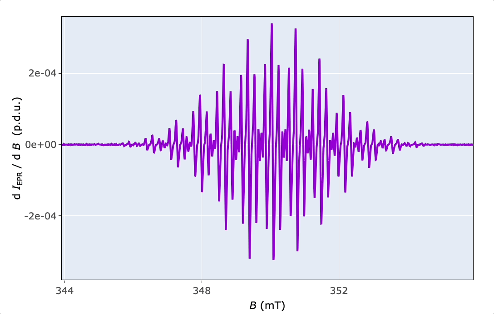

```{r knitr-setup, include = FALSE}
knitr::opts_chunk$set(
  collapse = TRUE,
  comment = "#>",
  webshot = "webshot",
  fig.width = 7.2,
  fig.height = 4.8
)
options(
  rmarkdown.html_vignette.check_title = FALSE
)
```

$\require{mhchem}$

```{r setup, include = FALSE}
library(eprscope)
library(knitr)
library(patchwork)
library(htmlwidgets)
library(ggplot2)
library(plotly)
```

# Introduction

The *Wuster's* reagent got its name according to *C. Wuster* who discovered the oxidation products of *p*-phenylenediamine derivatives [@GramppGpda2005]. It is a suitable compound to demonstrate the feasibility of Electron paramagnetic resonance (EPR) combined with the *in situ* electrochemistry/voltammetry because of the one-electron oxidation [@PetrAse1996]:

```{=tex}
\begin{equation}
\small \ce{TMPD <=>[-e^-] TMPD^{.+}}
(\#eq:tmpdoxid)
\end{equation}
```
where the $\small \ce{TMPD}$ stands for *N,N,N',N'*-tetramethyl-*p*-phenylenediamine (Wuster's reagent) abbreviation. The second oxidation step into di-cationic structure (not depicted in Equation \@ref(eq:tmpdoxid)) takes place far ($\small \approx (0.5-0.6)\,\mathrm{V}$) from the first one [@Dadpou2018]. Therefore, upon the first oxidation step, it changes its state from diamagnetic (not visible by EPR) to paramagnetic (with one unpaired electron) observable by a characteristic EPR spectrum, as shown below. Such change is not only visible by the "magic" where the nicely structured EPR spectrum rises from the noisy background upon oxidation, however, it is also associated with an exciting color change from almost colorless to violet-blue. Accordingly and unsurprisingly, **the radical cation of *N,N,N',N'*-tetramethyl-*p*-phenylenediamine is** described as ***Wuster's*** **blue**. Such example will demonstrate the main workflow to process and analyse EPR spectra by the `{eprscope}` 📦 . The $\small \ce{TMPD^{.+}}$ was generated electrochemically by potentiostatic electrolysis at 0.308 V (*vs* Ag-*quasiref.* electrode) of the corresponding $\small 1\,\mathrm{mM}$ $\small \ce{TMPD}$ solution in $\small 0.3\,\mathrm{M}\,\,\ce{TBAPF6}/\ce{DMSO}$.

# Drawing of Molecular Structures

Structure of the investigated compound can be depicted by the `draw_molecule_by_rcdk()` based on function coming from [{rcdk}](https://cdk-r.github.io/cdkr/) 📦 (see also [@GuhaRrcdk2007]) which is an {width="16" height="12"} toolbox of the [Chemistry Development Kit](https://cdk.github.io/), an open source modular java library for chemoinformatics [@WillighagenCDK2017].

```{r draw-molecule}

# radical cation Wuster's Reagent equivalent
# to N,N,N',N'-tetramethyl-p-phenylenediamine (TMPD) radical cation
# from 'SMILES' origin on "cob" ("color on black") canvas, without
# suppressing the hydrogen atoms
draw_molecule_by_rcdk(
  molecule = "CN(C)[C+]1C([H])=C([H])[C.]([N](C)C)C([H])=C1[H]",
  type = "smiles",
  style = "cob",
  mol.label = expression(TMPD^+. ~ "(" ~ Wuster * "'" * s ~ Blue ~ ")"),
  mol.label.color = "yellow",
  suppressh = FALSE
)

```

This function belongs to the package family/section `Visualizations and Graphics` and enables to create image of molecular structures either by [SMILES and SMART codes](https://chem.libretexts.org/Courses/Fordham_University/Chem1102%3A_Drug_Discovery_-_From_the_Laboratory_to_the_Clinic/05%3A_Organic_Molecules/5.08%3A_Line_Notation_(SMILES_and_InChI)) or by loading a **S**tructure **D**ata **F**ile (`.sdf`) [@Sakari2022].

# Reading Files and Writing Data Frames

The `{eprscope}` reads and converts pure (except the `.mat` format) text files. Therefore, to read the instrumental data files, recorded EPR spectra must be first converted into the ASCII format at the spectrometer. If the conversion option is not available, one can also try a free online converter by *Leland B. Gee* [@xepr2gfac2023]. To process the EPR spectral data, it is important not only to read the files with *Intensity vs. B* (usually in `.asc`, `.txt`, `.csv` format) but also associated files like those containing the instrumental parameters used to record the EPR spectra (usually in `.DSC` , `.dsc` or `.par` format). The information including in these files is required to e.g. normalize the Intensity (like $\small \mathrm{d}I_{\mathrm{EPR}}~/~\mathrm{d}B$ in the derivative spectral form) or to evaluate the $g$-factor (position of the spectrum) as well as for simulations of the EPR spectra and to evaluate the kinetic parameters of the radical reactions.

Reading of the instrumental parameters from `.DSC` / `.dsc` or `.par` files (corresponding to acquisition software "xenon"/"magnetech" or "winepr", respectively) is provided by several functions for different purposes e.g. for kinetic measurements or simulations. The general function `readEPR_params_tabs()` summarizes all important parameters in a list of data frames and can be converted into individual interactive tables by [{DT}](https://rstudio.github.io/DT/) package ➨

```{r instrum-params-read-df-info}

# package built-in example file => "TMPD_specelchem_accu_b.par"
tmpd.params.file <- 
  load_data_example(file = "TMPD_specelchem_accu_b.par")
#
# reading the parameter file coming from "winepr" acquisition softw.
tmpd.params <- readEPR_params_tabs(
  path_to_dsc_par = tmpd.params.file,
  origin = "winepr"
)
#
# the output `tmpd.params` is a list consisting
# of the "info" data frame (contaning characters)
tmpd.params$info # or `tmpd.params[["info"]]`

```

```{r instrum-params-reaad-df-params}

# and the second data frame is the "params",
# containing parameters, their values and units
tmpd.params$params # or `tmpd.params[["params"]]`

```

Finally, conversion of the second data frame (`tmpd.params$params`) can be performed by the `readEPR_params_tabs()` function with the argument `interact = "params"` .

The `origin` argument in reading functions reflects the differences in ASCII text file structure depending on the acquisition software. Moreover, while the intensity can be automatically normalized upon spectrum recording within "xenon"/"magnetech" software, the "winepr" intensity has to be normalized after the measurement if one wants to compare the intensities of two or several EPR spectra. The reading of the $\small \ce{TMPD^{.+}}$ spectral data by `readEPR_Exp_Specs()` proceeds as follows with the output having the form of the universal `data frame` format ➨

```{r spectral-data-read-norm-basic}

# loading package built-in example file => "TMPD_specelchem_accu_b.asc"
tmpd.data.file <- load_data_example(file = "TMPD_specelchem_accu_b.asc")

# intensity is normalized by the Q value (sensitivity factor)
# and the number of scans (`Nscans`). From the previous 
# parameter/info reading we know: Q = 3500 (in the `info` 
# data frame), Nscans = 20 (from `tmpd.params$params` 
# in the 5th row and the 2nd column)
tmpd.data.norm.01 <- readEPR_Exp_Specs(
  path_to_ASC = tmpd.data.file,
  col.names = c("B_G", "dIepr_over_dB"),
  qValue = 3500,
  norm.vec.add = tmpd.params$params[5,2],
  origin = "winepr"
)
#
# preview of the first six rows
head(tmpd.data.norm.01)

```

An arbitrary character string may be chosen for the column names (see `col.names` argument)[^1]. However, a safe rule of thumb is to use notation like "quantity_unit" as already shown above in the case of magnetic flux density $\small B$. The name for the intensity column reads `dIepr_over_dB` (without units) because it reflects the derivative mode $\small \mathrm{d}I_{\mathrm{EPR}}/\mathrm{d}B$ in CW (continuous wave) EPR. Other intensity related column names can be used as well. The above described function `readEPR_Exp_Specs()` can automatically convert $\small B$ values by the argument `convertB.unit=TRUE` (or `FALSE`) depending on the original units "G" or "mT". The reason is, that both units are quite often used to display the EPR spectra as well as to calculate the additional related quantities like $\small \Delta B$, $g$ or hyperfine splitting constants $a$. If the `Intensity` has to be normalized also by additional instrumental parameters like *conversion time* and *receiver gain* (automatically performed within "Xenon" software)*,* one should use the `quantify_EPR_Norm_const()` function from the `Evaluations and Quantification` family ➨

[^1]: For such reason there are arguments `x.id` and `Intensity.id` , pointing to original column indices, in order to properly pick up the corresponding variables.

```{r spectral-data-read-norm}

# calculation of the advanced normalization constant
# by selected parameters from the parameter list above,
# these parameters (WinEPR acq. spectrometer software)
# can be also obtained by the `readEPR_param_slct()`
# function with the codes described in the corresponding
# documentation
#
# following parameters are required (`req.params`) =>
# conversion time (RCT) in milliseconds, receiver gain (RRG) 
# unitless, sweep with (HSW) in Gauss, number of points (RES) 
# and number of scans/accumulations (JSD).
#
req.params <-
  readEPR_param_slct(tmpd.params.file,
    string = c("RCT", "RRG", "HSW", "RES", "JSD"),
    origin = "winepr"
  )
#
adv.norm.constant <- quantify_EPR_Norm_const(
  conv.time.ms = req.params$RCT,
  Nscans = req.params$JSD,
  Npoints = req.params$RES,
  rg = req.params$RRG,
  rg.unit = "Unitless",
  Bsw = req.params$HSW
)
#
# therefore, the reading of the experimental
# data file =>
tmpd.data.norm.02 <- readEPR_Exp_Specs(
  path_to_ASC = tmpd.data.file,
  col.names = c("B_G", "dIepr_over_dB"),
  qValue = 3500,
  norm.vec.add = adv.norm.constant,
  origin = "winepr"
)
#
# data frame preview
head(tmpd.data.norm.02)

```

Moreover, the `norm.vec.add` argument can involve additional normalization quantities like sample weight, concentration, number of scans (if not normalized by the spectrometer)...etc. If needed, all such quantities can be defined at once within the `norm.vec.add` .

Visualization and/or conversion of data frames (tables) into several formats like `.html` , `.pdf` , `.docx` or `.pptx`. can be provided by the most used ["table" packages](https://rfortherestofus.com/2019/11/how-to-make-beautiful-tables-in-r/). Among them, libraries/packages like [{DT}](https://rstudio.github.io/DT/), [{flextable}](https://davidgohel.github.io/flextable/index.html), [{gt}](https://gt.rstudio.com/), [{tinytable}](https://vincentarelbundock.github.io/tinytable/) and [{kableExtra}](https://haozhu233.github.io/kableExtra/) (see Section \@ref(hf-structure) below) are often used for publication ready table visualization. The last data frame previewed by the `{tinytable}` is shown in the following example.

```{r spectral-data-read-norm-tinytable}

# visualization of the first 10 rows by `{tinytable}` 
tinytable::tt(head(tmpd.data.norm.02, n = 10))

```

In order to process data frames by other software tools, different from {width="16" height="12"} (e.g. in excel-like sheet format), they may be exported into universal `.csv` table format like by `base::write.csv()` function ➨

```{r spectral-data-read-norm-csv-save}

write.csv(tmpd.data.norm.02,
  file = "tabs/TMPD_EPR_Norm_data02.csv",
  row.names = FALSE
  )

```

# Visualizations of Spectral Data

All the data related to EPR spectroscopy can be visualized by the [{ggplot2}](https://ggplot2.tidyverse.org/) 📦 and its [extensions](https://exts.ggplot2.tidyverse.org/gallery/) as well as by the interactive [{plotly}](https://plotly.com/r/) graphing library. While the first library/package (based on the "Grammar of Graphics"[^2] , see also [@WilkinsonGG2005]) is one of the most comprehensive system for data visualization, the second one represents a valuable alternative to processing/acquisition software at EPR spectrometers. Namely, it includes tools like zooming, panning, data/values hovering and [much more](https://plotly.com/r/configuration-options/). Combination of both approaches possesses literally endless possibilities how to visualize the data in electron paramagnetic resonance spectroscopy.

[^2]: *The Grammar of Graphics* is a concept how the graphs/plots are built. It is based on the fact that graphs may consist of several components/layers (e.g. like data layer, geometry layer, aesthetic layer...etc) similarly to processing of a bitmap-image in a photo-editor. The term "*grammar*" corresponds to the structure of a sentence in language and thus it may represent a structure of the graph/plot in R programming language.

## Static Plots by `{ggplot2}` and `{patchwork}`

The `plot_EPR_Specs()` is the essential function for plotting individual EPR spectra as well as those within series (e.g. time series $\equiv$ kinetic measurements). Now, by means of this function and by the [{patchwork}](https://patchwork.data-imaginist.com/) 📦 , we can compare the EPR spectra with the basic and "advanced" normalization ➨

```{r spectral-data-norm01-visual,fig.cap="EPR spectrum of $\\small \\ce{TMPD^{.+}}$ in $\\small 0.3\\,\\mathrm{M}~\\ce{TBAPF6}/\\ce{DMSO}$ after potentiostatic oxidative electrolysis at $\\small 0.308\\,\\mathrm{V}$ vs Ag-quasiref. Intensity normalized by number of scans, 'Nscans', and by sensitivity Q-factor, 'qValue'."}

# plotting the spectrum with basic normalization,
# the B-axis can be presented either 
# in "mT" (default) or "G" plot title is added 
# by `ggtitle()` function from `{ggplot2}` package
tmpd.plot.norm.01 <-
  plot_EPR_Specs(data.spectra = tmpd.data.norm.01) +
  ggplot2::ggtitle("Basic Normalization")
#
# preview
tmpd.plot.norm.01

```

Comparison of both spectra with different normalization ➨

```{r spectral-data-norm0102-visual,fig.cap="Comparison of $\\small \\ce{TMPD^{.+}}$ EPR spectra with different intensity normalization."}

# spectrum with the "advanced" normalization
tmpd.plot.norm.02 <-
  plot_EPR_Specs(data.spectra = tmpd.data.norm.02) +
  ggplot2::ggtitle("Advanced Normalization")
#
# both spectra together by `{patchwork}` package
# without y/Intensity label (`ggplot2::labs(y = NULL)`) 
# because the EPR spectra will be displayed close 
# to each other in two columns
tmpd.plot.norm.0102 <-
  tmpd.plot.norm.01 +
  tmpd.plot.norm.02 +
  ggplot2::labs(y = NULL)
#
# preview of EPR spectra with different intensities
tmpd.plot.norm.0102

```

If one wants to save the previous Figure \@ref(fig:spectral-data-norm0102-visual) the function `ggplot2::ggsave()` can be applied ➨

```{r spectral-data-norm0102-visual-save}

# to save the plot `tmpd.plot.norm.0102` with the size
# of (7 x 5) inches and the resolution of dpi = 200
ggplot2::ggsave("images/TMPD_EPR_Norm_compar.png",
  plot = tmpd.plot.norm.0102,
  width = 7,
  height = 5,
  units = "in",
  dpi = 200
)

# other image formats like `.pdf`, `.tex`,`.jpeg`, `.eps`,
# `.bmp`, `.svg` or `.tiff` can be used as well

```

## Interactive Plots by `{plotly}`

In order to explore the EPR spectrum in details (to read values, zoom or save the spectrum), function `plot_EPR_Specs2D_interact()` is applied (consult the corresponding function example). Additionally, it can be also used for a series of overlaid EPR spectra similarly to `plot_EPR_Specs()`. Additional interactive 3D-plotting of EPR spectra, especially those recorded as time series, like during kinetic or variable temperature experiments are provided by the `plot_EPR_Specs3D_interact()` function.

{width="654"}

# Basic EPR Spectral Characteristics

There are four basic parameters to characterize the EPR spectrum ➨

1.  Spectrum position expressed by the $g_{\mathrm{iso}}$-value

2.  Linewidth, for derivative line form expressed by the $\small \Delta B_{\mathrm{pp}}$, that is the difference between $\small B_{\mathrm{max}}$ and $\small B_{\mathrm{min}}$ corresponding to position of maximum and minimum intensity, respectively. For the integrated spectral form, the linewidth is expressed by the $\small FWHM$ ("full width at half-maximum" or "full width at half-height").

3.  Hyperfine splitting, $a$ (in $\mathrm{m \small T}$ or $\small \mathrm{G}$) which is the distance between the individual lines corresponding to interaction of the unpaired electron with the group of surrounding equivalent nuclei.

4.  Single or double integral depending on the original spectral line form ➨ either integrated or derivative. This is directly proportional to the number of paramagnetic species/radicals.

## Finding the *g*~iso~-Value

The parameter is defined by the following Equation \@ref(eq:gfactor):

```{=tex}
\begin{equation}
\small g_{\mathrm{iso}} = \frac{h\,\nu}{\mu_{\mathrm{B}}\,B_0}
(\#eq:gfactor)
\end{equation}
```
where the $h$ and $\mu_{\mathrm{B}}$ are Plank's and Bohr magneton constants, respectively. Therefore, it is determined only by the microwave frequency ($\nu$) and the magnetic flux density ($\small B_0$) of the spectrum mid-point where $\small \mathrm{d}I_{\mathrm{EPR}}/\mathrm{d}B = 0$ (in the case of CW EPR spectra, see also function `eval_gFactor_Spec()`).

```{r spectral-data-norm02-gvalue}

# reading the microwave frequency ("MF") from the `.par` file
tmpd.mw.freq <-
  readEPR_param_slct(tmpd.params.file,
    string = "MF",
    origin = "winepr"
  )
# B region (349.677, 350.457) mT, including 
# the B mid-point, to calculate the g-value 
# is obtained from the interactive plot above
tmpd.g.iso.spec <-
  eval_gFactor_Spec(tmpd.data.norm.02,
    nu.GHz = tmpd.mw.freq,
    B = "B_mT",
    B.unit = "mT",
    Blim = c(349.677, 350.457)
  )
#
# value preview
tmpd.g.iso.spec

```

The above (from spectrum) obtained $g_{\mathrm{iso}}$-value may be compared with that computed by Density Functional Theory (DFT) quantum chemical calculations of $\small \ce{TMPD^{.+}}$, namely by PBE0/EPR-II/CPCM-DMSO//B3LYP/6-31+G(d,p) (see also [Gaussian DFT Methods](https://gaussian.com/dft/) and [Basis Sets](https://gaussian.com/basissets/)). The extraction of $g_{\mathrm{iso}}$-value from the *Gaussian* (or from the [ORCA quantum chemical package](https://www.orcasoftware.de/tutorials_orca/index.html)) output file is provided by the `eval_gFactor_QCHcomp()` function ➨

```{r dft-data-norm02-gvalue}

# package built-in example file => 
# "TMPDAradCatEPRa.inp.log.zip"
# which is a `.zip` of the Gaussian output file
gauss.tmpd.load <- 
  load_data_example(file = "TMPDAradCatEPRa.inp.log.zip")
gauss.tmpd.output <- unzip(gauss.tmpd.load)
#
# giso-value is automatically calculated as the mean
# of its principal components (g1,g2,g3) 
# summarized in the output files
tmpd.g.iso.dft <- 
  eval_gFactor_QCHcomp(gauss.tmpd.output)
#
# preview
tmpd.g.iso.dft
#
# comparison of both theoretical and experimental g-values
# within the tolerance of 1e-3, to illustrate the automatic
# comparison of two values in R language, the function 
# `all.equal()`can be applied
all.equal(tmpd.g.iso.spec, tmpd.g.iso.dft, tolerance = 1e-3)

```

The `TRUE` value represents a perfect agreement between the theoretically (`2.00317`) and the experimentally (`2.00304`) determined $g_{\mathrm{iso}}$-values, thus supporting the structure of $\small \ce{TMPD^{.+}}$. Its difference from the free electron $g_{\mathrm{e}}\approx \small 2.00232$ is a consequence of [spin-orbit coupling (SOC)](https://chem.libretexts.org/Bookshelves/Physical_and_Theoretical_Chemistry_Textbook_Maps/Electron_Paramagnetic_Resonance_(Jenschke)/03%3A_Electron_Zeeman_Interaction/3.01%3A_Physical_origin_of_the_(g)_shift) of the unpaired electron within the radical cation. Namely, it tells how the individual atomic orbitals contribute to single occupied molecular orbital (SOMO), i.e. the orbital characterizing the unpaired electronic state. Therefore, for $\small \ce{TMPD^{.+}}$ the SOC is not so pronounced because of the small difference from $g_{\mathrm{e}}$. However, for heavy atoms (e.g. central atoms in metal complexes) the difference is often large and indicates larger SOC than for organic radicals like for the one mentioned above [@Weilepr2007].

## Linewidth, 𝚫*B*~pp~ Determination

The linewidth in $\mathrm{m\small T}$ can be determined from several spectral lines/regions from the interactive plot above and by the `eval_DeltaXpp_Spec()` function ➨

```{r spectral-data-norm02-linewidth}

# calculate Delta Bpp from several regions
# => list of three selected elements/regions
B.regions.mT <- list(
  c(349.677, 349.977),
  c(349.177, 349.492),
  c(350.822, 351.072)
)
#
# all Delta Bpp as vector, created by the iteration 
# through all elements (with the help of 
# `sapply()` function) of `B.regions.mT`
tmpd.delta.Bpp <- sapply(
  B.regions.mT,
  function(b) {
    eval_DeltaXpp_Spec(tmpd.data.norm.02,
      xlim = b
    )
  }
)
#
# mean value of all three linewidths in mT
tmpd.delta.Bpp.mean <-
  round(mean(tmpd.delta.Bpp), digits = 2)
#
# value preview
tmpd.delta.Bpp.mean

```

## Hyperfine (HF) Structure and Simulations {#hf-structure}

The **HF** structure represents one of the most important characteristic of EPR spectra because it reflects the distribution of unpaired electron within the radical/paramagnetic molecule. At least some of the hyperfine splitting constants ($a$, HFSCs, distance between the main lines within the pattern) may be estimated from the interactive EPR spectrum above. For the subsequent simulation of the EPR spectrum these are simply converted by `convert_a_mT_2A()` into hyperfine coupling constants in $\mathrm{\small{MH}z}$ ($\small A$, HFCCs), by the following relation (Equation \@ref(eq:hfatoA)) ➨

```{=tex}
\begin{equation}
 \small A = \frac{a\,g\,\mu_{\mathrm{B}}}{h}
 (\#eq:hfatoA)
 \end{equation}
```
```{r a-to-A-from-spectrum}

# two visible distances or HFSCs (a in mT)
# from the interactive EPR spectrum above
a1.guess.mT <- abs(350.042 - 349.342)
a2.guess.mT <- abs(349.147 - 349.342)
# both values into vector
a.guess.mT <- c(a1.guess.mT, a2.guess.mT)
#
# conversion into A (in MHz) incl. g.iso value
# (`tmpd.g.iso.spec`) from the calculation above
A.guess.MHz <-
  sapply(
    a.guess.mT,
    function(x) {
      convert_a_mT_2A(
        a.mT = x,
        g.val = tmpd.g.iso.spec
      )
    }
  )
#
# `A.guess.MHz` preview
A.guess.MHz

```

According to literature [@GramppGpda2005] and the $\small \ce{TMPD^{.+}}$ structure (see also Figure \@ref(fig:dft-tmpd-structure) with the DFT-optimized geometry), one can recognize three interacting groups of equivalent nuclei : $\small 2\,\times\,\ce{^{14}N}$, $\small 4\,\times\,\ce{^1H}$ (aromatic protons) and $\small 12\,\times\,\ce{^1H}$ (methyl protons). DFT calculations may provide all $\small A$ (HFCCs) as shown below.

```{r dft-tmpd-structure,fig.cap="DFT optimized structure of TMPD radical cation with atom numbering inherited from Gaussian 16 output file."}

# loading built-in image
knitr::include_graphics("images/TMPD_EPR_DFT_radCat_ab.png",dpi = 200)

```

In order to compare the theoretical as well as experimental HFCCs, the function `rearrange_aAiso_QCHorgau()` extracts the $\small A$ values from the Gaussian or [ORCA](https://www.orcasoftware.de/tutorials_orca/index.html) output files and calculates the mean values corresponding to selected groups of equivalent nuclei which are defined by the `nuclei.list.slct` argument. Therefore, according to numbering shown in Figure \@ref(fig:dft-tmpd-structure) ➨

```{r As-DFT-from-gaussian}

# The same package built-in example file 
# (`TMPDAradCatEPRa.inp.log.zip`)
# as for the extraction of g-value is used (see above).
symmetry.As.df <-
  rearrange_aAiso_QCHorgau(gauss.tmpd.output,
    N.nuclei = 28,
    nuclei.list.slct =
      list(
        c(7, 8), # 2 x 14N
        c(13, 14, 15, 16), # 4 x 1H (aromatic)
        c(
          17, 18, 19, 20,
          21, 22, 23, 24,
          25, 26, 27, 28
      ) # 12 x 1H (methyls)
    )
  )
#
# data frame presentation by `{kableExtra}` package
kableExtra::kbl(symmetry.As.df) %>%
  kableExtra::kable_styling(
    bootstrap_options = 
      c("striped",
        "hover",
        "condensed"
  )
)

```

The previous analysis reveals that the highest HF-coupling/splitting constants are related to the interaction of unpaired electron with the nitrogen and methyl-proton nuclei. Therefore the highest spin density is located on the "periphery" of the $\small \ce{TMPD^{.+}}$ molecule. This may be also supported by the simulation (theoretical calculation) of the EPR spectrum (which is computed by the `eval_sim_EPR_iso()` function) by taking into account the following parameters ➨

-   position of the EPR spectrum ($g_{\mathrm{iso}}$-value) ➨ `g.iso`

-   spectral linewidth corresponding to Gaussian and/or Lorentzian lineshape ➨ `lineGL.DeltaB`

-   content of the Gaussian lineshape in the overall linear combination of both Gaussian and Lorenztian theoretical spectral forms (so called pseudo-Voigt lineshape) ➨ `lineG.content`

-   additional instrumental parameters like central field ➨ `Bcf`, sweep width ➨ `Bsw`, microwave frequency ➨ `mwGHz` and number of points (spectral resolution) ➨ `Npoints`.

Required arguments of the `eval_sim_EPR_iso()` function are presented after the arrows. By considering all the above-listed parameters and the estimated linewidth `tmpd.delta.Bpp.mean` ($\small 0.5\,\mathrm{G}$) as well as the HFCCs, either directly estimated from the spectrum (`A.guess.MHz`) or from the quantum chemical calculations (`symmetry.As.df`) or taken from the literature [@GramppGpda2005], the EPR spectrum of $\small \ce{TMPD^{.+}}$ can be simulated as follows ➨

```{r tmpd-radcat-simulation}

# isotropic simulation of the TMPD radical cation where
# the instrumental parameters are taken from 
# the corresponding `.par` file: `tmpd.params.file` :
sim.tmpd.iso <-
  eval_sim_EPR_iso(
    g.iso = tmpd.g.iso.spec,
    instrum.params = NULL,
    path_to_dsc_par = tmpd.params.file,
    origin = "winepr",
    B.unit = "mT",
    nuclear.system =
      list(
        list("14N", 2, 18.6), # A(2 x 14N) = 18.6 MHz
        list("1H", 4, 5.5), # A(4 x 1H) = 5.5 MHz
        list("1H", 12, 19.6) # A(12 x 1H) = 19.6 MHz
      ), 
    # Gauss (G) & Lorentz (L) linewidth (mT):
    lineGL.DeltaB = list(0.05, 0.05),
    # pseudo-Voigt line shape with 0.5 G + 0.5 L:
    lineG.content = 0.5
  )
#
# output is either interactive spectrum plot
# or list of plot and the simulated 
# spectrum data frame.
#
# preview of the data frame
head(sim.tmpd.iso$df)

```

Afterwards, the simulated EPR spectrum can be presented/compared with the experimental one by the `presentEPR_Sim_Spec()` function (Figure \@ref(fig:tmpd-radcat-sim-expr-compar)), which is essentially based on `{ggplot2}` package and therefore can be combined with the [additional {ggplot2} functions](https://ggplot2.tidyverse.org/reference/index.html) .

```{r tmpd-radcat-sim-expr-compar, fig.cap="Comparison of simulated and experiental EPR spectrum of $\\small \\ce{TMPD^{.+}}$."}

# intesinty of the simulated spectrum
# is automatically scalled onto 
# the experimental one.
present_EPR_Sim_Spec(
  data.spectr.expr = tmpd.data.norm.02,
  data.spectr.sim = sim.tmpd.iso$df,
  B.unit = "mT"
  ) +
  # `plot_theme_NoY_ticks` theme from `{eprscope}`
  plot_theme_NoY_ticks(legend.text = element_text(size = 13))

```

Although the simulated $\ce{TMPD^{.+}}$ EPR spectrum is quite close to the experimental one, there are still some apparent differences. Therefore, the fitting/optimization function `eval_sim_EPR_isoFit()` was used to get a more accurate simulated spectrum. The result may be found in `Examples` of the `present_EPR_Sim_Spec()` function.

## Integrating the EPR Spectrum

Integration process in the analysis of EPR spectra is undoubtedly an important operation because it mirrors the amount of paramagnetic centers/radicals within the sample (see also `quantify_EPR_Abs()`). However, it is heavily dependent on the initial form of the EPR spectrum, i.e. whether it is present either in derivative (usually in CW EPR) or already integrated (usually in 1D pulsed EPR) form/shape. Hence, the spectrum has to be integrated either twice or only once, respectively. The core-function used for the integration is based on the cumulative trapezoidal approximation, available from the [{pracma}](https://github.com/cran/pracma) 📦 `pracma::cumtrapz()` [@Rpracma2023; @LibreMath2023; @Math24net2023; @epperson2013intro].

The relative error of the cumulative trapezoidal integration is minimal, usually falling into the range of $\small \langle 1-5\rangle\,\%$ or even lower depending on the spectrum resolution [@LibreMath2023; @epperson2013intro]. If the initial EPR spectrum displays low signal-to-noise ratio, the integral required for the quantitative analysis looses its sigmoid-shape ( see below an example of such shape). Therefore, in such case, the best option is to simulate the EPR spectrum and to evaluate the integral from that spectrum (see e.g. `quantify_EPR_Sim_series()` function). The big advantage of this method consists in graphical representation of the corresponding integrals, i.e. the integration process may be visually controlled in the same manner like within the EPR spectrometer acquisitions/processing software (see also `plot_EPR_Specs_integ()` function below). The integration of the EPR spectral data is essentially provided by the `eval_integ_EPR_Spec()` and its application to the experimental $\small \ce{TMPD^{.+}}$ spectrum is documented by the following scripts ➨

```{r tmpd-basic-epr-integ}

# basic integration without baseline correction
# during the first integration.
tmpd.data.norm.02.integ <-
  eval_integ_EPR_Spec(
    data.spectr = tmpd.data.norm.02,
    B = "B_mT",
    B.unit = "mT",
    sigmoid.integ = TRUE
  )
#
# integration returns the original data frame
# with the additional integrals 
# `single_Integ` + `sigmoid_Integ`
#
# preview
head(tmpd.data.norm.02.integ)

```

Both integrals, within the entire $\small B$-range, can be visualized by `plot_EPR_Specs_integ()` function from `Visualization and Graphics` family:

```{r tmpd-basic-epr-integ-visual,fig.cap = "Single (`single_Integ`) and double (`sigmoid_Integ`) integrated EPR spectrum of $\\small \\ce{TMPD^{.+}}$."}

# both integrals are presented separately
# with their corresponding intensities automatically
# scaled onto the `y`-axis (defined by "free_y")
plot_EPR_Specs_integ(
  tmpd.data.norm.02.integ,
  slct.integs = c(
    "single_Integ",
    "sigmoid_Integ"
  ),
  B = "B_mT",
  B.unit = "mT",
  separate.integs = TRUE,
  separate.integ.scales = "free_y"
)

```

Obviously, the baseline of the single and double integrated $\small \ce{TMPD^{.+}}$ EPR spectrum is somewhat distorted and must be corrected. To fix the baseline distortion, the `eval_integ_EPR_Spec()` function contains corresponding arguments which control the baseline approximation, under the complex peak, by a polynomial fit and provide its subtraction from the single integrated spectrum to evaluate the double/sigmoid integral more accurately ➨

```{r tmpd-correct-epr-integ, fig.cap = "Corrected single and double integrated EPR spectrum of $\\small \\ce{TMPD^{.+}}$ (see also Figure \\@ref(fig:tmpd-basic-epr-integ-visual))."}

# correction of the TMPD^{.+} EPR spectrum single
# integral by the 3rd degree polynomial
tmpd.data.norm.02.integCorr <-
  eval_integ_EPR_Spec(
    data.spectr = tmpd.data.norm.02,
    B = "B_mT",
    B.unit = "mT",
    correct.integ = TRUE,
    # peak region to correct the baseline:
    BpeaKlim = c(344.5, 355.5),
    # polynomial degree to fit baseline 
    # under the peak region:
    poly.degree = 3,
    sigmoid.integ = TRUE
  )
#
# preview of the integrals,
# data frame column of corrected integral
# is denoted as `single_Integ_correct`
plot_EPR_Specs_integ(
  tmpd.data.norm.02.integCorr,
  slct.integs = c(
    "single_Integ_correct",
    "sigmoid_Integ"
  ),
  B = "B_mT",
  B.unit = "mT",
  separate.integs = TRUE,
  separate.integ.scales = "free_y"
)

```

Maximal value of the double/sigmoid integral `r round(max(tmpd.data.norm.02.integCorr$sigmoid_Integ),digits = 4)` can be used for the estimation of $\small \ce{TMPD^{.+}}$ amount within the sample.

# References {.unnumbered}
